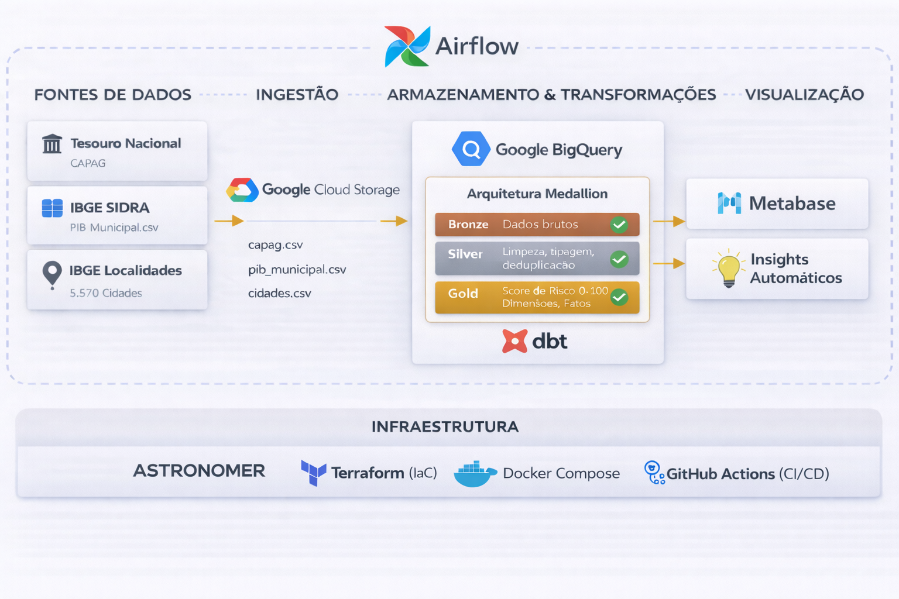
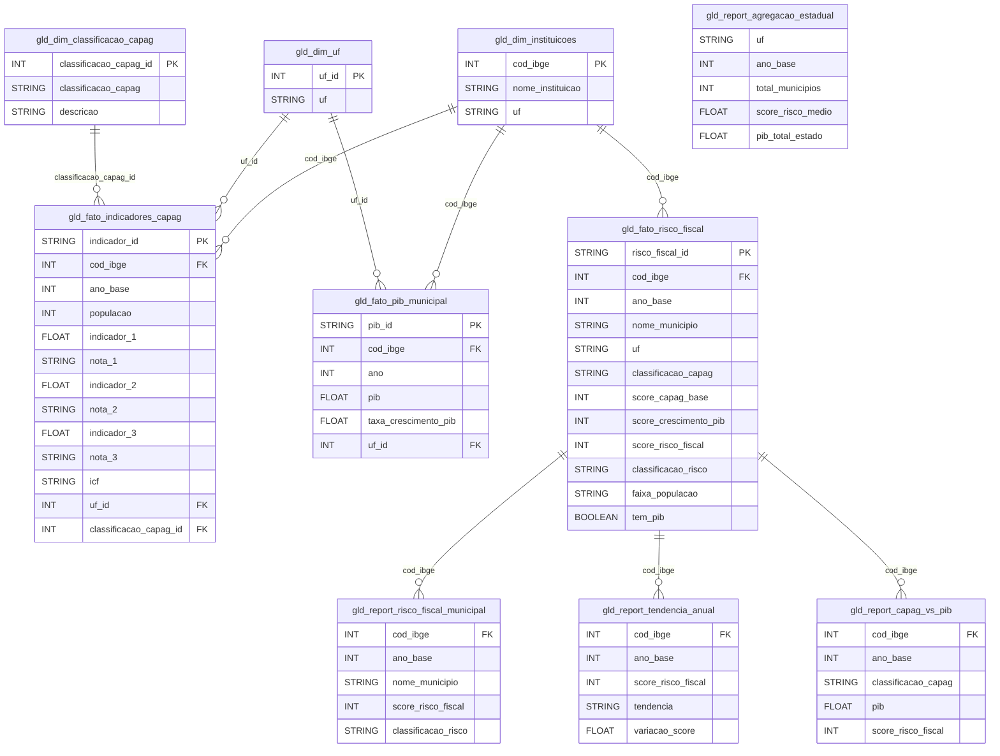

# Sistema de Monitoramento de Risco Fiscal Municipal

## Sumário

1. [Objetivo do Projeto](#1-objetivo-do-projeto)
2. [Arquitetura de Solução](#2-arquitetura-de-solução)
3. [Fontes de Dados](#3-fontes-de-dados)
4. [Arquitetura Medalhão (Bronze / Silver / Gold)](#4-arquitetura-medalhão-bronze--silver--gold)
5. [Pipeline de Dados](#5-pipeline-de-dados)
6. [Validação de Qualidade (dbt tests)](#6-validação-de-qualidade-dbt-tests)
7. [Insights Automáticos](#7-insights-automáticos)
8. [Dashboards no Metabase](#8-dashboards-no-metabase)
9. [Infraestrutura como Código (Terraform)](#9-infraestrutura-como-código-terraform)
10. [CI/CD (GitHub Actions)](#10-cicd-github-actions)
11. [Reprodução do Projeto](#11-reprodução-do-projeto)
12. [Stack Tecnológica](#12-stack-tecnológica)

---

## 1. Objetivo do Projeto

Este projeto implementa um **Sistema de Monitoramento de Risco Fiscal Municipal**, cruzando dados de **CAPAG** (Capacidade de Pagamento — Tesouro Nacional) com o **PIB Municipal** (IBGE) para avaliar a saúde fiscal dos municípios brasileiros.

O sistema gera um **score de risco fiscal composto (0–100)** que combina a classificação CAPAG (até 70 pts — já consolida endividamento, poupança corrente e liquidez) com o crescimento do PIB municipal (até 30 pts), classificando cada município em: **BAIXO**, **MODERADO**, **ELEVADO**, **CRÍTICO** ou **INDETERMINADO** (quando não há dados suficientes).

### O que é CAPAG?

O processo CAPAG (Capacidade de Pagamento) é um sistema de avaliação da Secretaria do Tesouro Nacional (STN) que analisa a situação fiscal dos estados e municípios. Avalia três indicadores e, a partir de 2024, incorpora também o ICF:

| Indicador | O que mede | Critério |
| --- | --- | --- |
| Indicador 1 | Endividamento (DC/RCL) | Menor = melhor |
| Indicador 2 | Poupança Corrente | Maior = melhor |
| Indicador 3 | Liquidez | Acima de 1 = adequado |
| ICF | Qualidade da Informação Contábil e Fiscal | Ranking Siconfi |

> **Nota sobre o ICF (a partir de 2024):** O ICF (Índice de Qualidade da Informação Contábil e Fiscal) é a nota obtida pelo município no [Ranking da Qualidade da Informação Contábil e Fiscal no Siconfi](https://ranking-municipios.tesouro.gov.br/). A partir de 2024, a classificação final da CAPAG passou a considerar não apenas as notas 1, 2 e 3, mas também o ICF. Isso significa que municípios com baixa qualidade de informação contábil podem ter sua nota CAPAG rebaixada. Para anos anteriores a 2024 (ano_base < 2023), esta coluna é nula pois o indicador não existia.

### O que é PIB Municipal?

Dados do IBGE (tabela SIDRA 5938) com o Produto Interno Bruto de cada município. O download é feito via API SIDRA, retornando o PIB a preços correntes (variável 37 — Mil Reais) para todos os municípios, com cobertura de 2015 a 2023.

---

## 2. Arquitetura de Solução

### Diagrama do Pipeline



### Fluxo Detalhado

```
                    ┌──────────────────────────────────────┐
                    │        GitHub Actions (CI/CD)         │
                    │  ci.yml: dbt + Docker + Python lint   │
                    │  terraform.yml: plan (PR) / apply     │
                    └──────────────────┬───────────────────┘
                                       │
┌──────────────────────────────────────────────────────────────┐
│                  Terraform (infra/)                           │
│   Provisiona: GCS bucket + 6 datasets BigQuery + lifecycle   │
└──────────────────────────┬───────────────────────────────────┘
                           │ provisiona
                           ▼
┌─────────────────┐   ┌─────────────────┐   ┌─────────────────┐
│  dados.gov.br   │   │  IBGE / SIDRA   │   │ IBGE Localidades│
│  (CAPAG XLSX)   │   │  (PIB Municipal)│   │   (Municípios)  │
└────────┬────────┘   └────────┬────────┘   └────────┬────────┘
         │ download              │ download            │ download
         ▼                       ▼                     ▼
┌─────────────────────────────────────────────────────────────┐
│                   Google Cloud Storage                       │
│     (raw/capag.csv, raw/pib_municipal.csv, raw/cidades.csv)  │
└──────────────────────────┬──────────────────────────────────┘
                           │ load
                           ▼
┌─────────────────────────────────────────┐
│              BigQuery                    │
│                                          │
│  ┌──────────┐ ┌──────────┐ ┌──────────┐ │
│  │  BRONZE  │→│  SILVER  │→│   GOLD   │ │
│  │  (views) │ │ (limpo)  │ │ (negócio)│ │
│  └──────────┘ └──────────┘ └──────────┘ │
│     ↑ dbt test  ↑ dbt test   ↑ dbt test │
└────────────────┬────────────────────────┘
                 │
        ┌────────┴────────┐
        ▼                 ▼
┌──────────────┐  ┌──────────────┐
│   Metabase   │  │   Insights   │
│  Dashboards  │  │  Automáticos │
└──────────────┘  └──────────────┘
```

### Infraestrutura (Terraform)

Toda a infraestrutura GCP é provisionada via **Terraform** (`infra/`), incluindo:
- Bucket GCS com versionamento e lifecycle policies (Nearline após 90 dias)
- 6 datasets BigQuery (capag, cidades, pib, bronze, silver, gold) com labels por camada
- Variáveis centralizadas em `variables.tf` para fácil customização

### CI/CD (GitHub Actions)

Dois workflows automatizados em `.github/workflows/`:
- **CI - Pipeline de Dados** (`ci.yml`): valida sintaxe SQL (dbt parse) em todo push/PR na main
- **Terraform - Infraestrutura** (`terraform.yml`): plan em PR, apply em merge na main

### Orquestração (Airflow)

```
[download_capag, download_pib, download_cidades]  (paralelo, retries=2, timeout=30min)
    → [upload GCS: capag, cidades, pib]  (paralelo)
    → [GCS → BigQuery raw tables]
    → Bronze (dbt run — DbtTaskGroup)
    → dbt test bronze (external_python no dbt_venv)
    → Silver (dbt run — DbtTaskGroup)
    → dbt test silver
    → Gold (dbt run — DbtTaskGroup)
    → dbt test gold
    → Geração de Insights Automáticos (salva em gold.insights_risco_fiscal)
```

**Resiliência do pipeline:**
- `default_args`: retries=1, retry_delay=2min, execution_timeout=60min por task
- Tasks de download: retries=2, retry_delay=3min, timeout=30min (APIs externas)
- `max_active_runs=1`: evita execuções paralelas da mesma DAG
- `dagrun_timeout=4h`: timeout total do pipeline
- `on_failure_callback`: log estruturado de falhas (extensível para Slack/email)

**Download incremental:**
- Antes de baixar, os scripts verificam quais anos já existem no GCS (via `gcs_utils.py`) ou no CSV local
- Apenas anos novos são baixados e concatenados ao CSV existente, evitando reprocessamento desnecessário

---

## 3. Fontes de Dados

| Fonte | Origem | Frequência | Download | Freshness (dbt) |
| --- | --- | --- | --- | --- |
| CAPAG | dados.gov.br (Tesouro Nacional) | Quadrimestral | Automático via API (XLSX → CSV) | warn: 120d, error: 180d |
| Cidades | IBGE API Localidades | Relativamente estático | Automático via API | — |
| PIB Municipal | IBGE SIDRA (tabela 5938) | Anual | Automático via API SIDRA (requests) | warn: 365d, error: 450d |

### Estrutura do CAPAG (13 colunas)

| Coluna | Descrição |
| --- | --- |
| INSTITUICAO | Nome do município |
| COD_IBGE | Código IBGE (7 dígitos) |
| UF | Unidade Federativa |
| POPULACAO | População do município |
| INDICADOR_1 / NOTA_1 | Endividamento (DC/RCL) e classificação |
| INDICADOR_2 / NOTA_2 | Poupança corrente e classificação |
| INDICADOR_3 / NOTA_3 | Liquidez e classificação |
| CLASSIFICACAO_CAPAG | Nota geral (A, B, C, D) |
| ICF | Ranking da Qualidade da Informação Contábil e Fiscal no Siconfi (a partir de 2024, nulo para anos anteriores) |
| ANO_BASE | Ano base dos dados |

### Estrutura do PIB Municipal (5 colunas)

| Coluna | Descrição |
| --- | --- |
| ano | Ano de referência |
| cod_ibge | Código IBGE do município |
| nome_municipio | Nome do município |
| uf | Sigla da UF |
| pib | PIB total a preços correntes (R$ x 1000) |

### Estrutura de Cidades (4 colunas)

| Coluna | Descrição |
| --- | --- |
| Id | Sequencial |
| Codigo | Código IBGE do município |
| Nome | Nome do município |
| UF | Sigla da UF |

---

## 4. Arquitetura Medalhão (Bronze / Silver / Gold)

### Bronze (dataset: `bronze`) — 3 views
Views que espelham 1:1 os dados brutos do BigQuery. Sem transformação.

| Modelo | Source |
| --- | --- |
| `brz_capag_brasil` | capag.capag_brasil |
| `brz_cidades_brasil` | cidades.cidades_brasil |
| `brz_pib_municipal` | pib.pib_municipal |

### Silver (dataset: `silver`) — 5 tabelas
Dados limpos, tipados, deduplicados e validados. Particionados por ano quando aplicável.

| Modelo | Descrição | Partição |
| --- | --- | --- |
| `slv_capag_municipios` | CAPAG limpo: SAFE_CAST, dedup por cod_ibge+ano_base, tratar `n.d.` como NULL, surrogate key | ano_base |
| `slv_cidades` | Municípios deduplicados por cod_ibge (ROW_NUMBER) | — |
| `slv_pib_municipal` | PIB limpo, deduplicado (mantém maior PIB em caso de duplicata), surrogate key | ano |
| `slv_dim_uf` | Dimensão UF: union distinct de CAPAG + cidades, gera `uf_id` com ROW_NUMBER | — |
| `slv_dim_classificacao_capag` | Dimensão classificação (A/B/C/D) com descrição por extenso, gera `classificacao_capag_id` | — |

### Gold (dataset: `gold`) — 10 tabelas
Modelos de negócio prontos para consumo analítico e dashboards.

#### Dimensões (3 tabelas)
| Modelo | Descrição |
| --- | --- |
| `gld_dim_instituicoes` | Municípios com nome, cod_ibge, UF — FULL OUTER JOIN entre cidades e CAPAG para não perder registros |
| `gld_dim_uf` | Unidades Federativas (promove slv_dim_uf para Gold) |
| `gld_dim_classificacao_capag` | Classificações CAPAG com descrição (promove slv_dim_classificacao_capag para Gold) |

#### Fatos (3 tabelas)
| Modelo | Descrição | Partição | Cluster |
| --- | --- | --- | --- |
| `gld_fato_indicadores_capag` | Indicadores CAPAG por município/ano com FKs para dimensões | ano_base (range 2015–2030) | uf_id, classificacao_capag_id |
| `gld_fato_pib_municipal` | PIB com taxa de crescimento YoY via `LAG()` + `SAFE_DIVIDE` | ano (range 2002–2030) | uf_id |
| `gld_fato_risco_fiscal` | **MODELO PRINCIPAL**: cruza CAPAG × PIB, score 0–100, classificação de risco, faixa populacional | ano_base (range 2015–2030) | classificacao_risco, uf |

#### Reports (4 tabelas pré-calculadas para Metabase)
| Modelo | Finalidade |
| --- | --- |
| `gld_report_risco_fiscal_municipal` | Visão detalhada por município: score, classificação, indicadores, PIB |
| `gld_report_tendencia_anual` | Evolução YoY com self-join: variação de score e tendência (MELHORIA/PIORA/ESTAVEL/SEM_HISTORICO) |
| `gld_report_capag_vs_pib` | Correlação CAPAG × PIB — apenas municípios com PIB disponível |
| `gld_report_agregacao_estadual` | Visão consolidada por estado: totais, médias, % risco alto, PIB do estado |

#### Insights (tabela gerada por Python)
| Modelo | Descrição |
| --- | --- |
| `insights_risco_fiscal` | Narrativas automáticas geradas pelo agente de insights (6 tipos) |

### Modelagem de Dados — Camada Gold



### Score de Risco Fiscal (0–100 pontos)

O score combina dois componentes independentes. Quando apenas um componente está disponível, ele é reescalado para 0–100. Quando nenhum está disponível, o score é NULL e a classificação é INDETERMINADO.

| Componente | Peso | Critério |
| --- | --- | --- |
| Classificação CAPAG | 0–70 pts | A=70, B=50, C=25, D=0 — já consolida endividamento, poupança corrente e liquidez |
| Crescimento PIB | 0–30 pts | ≥10%=30, ≥5%=24, ≥2%=18, ≥0%=12, <0%=6, nulo/sem PIB=0 |

**Comportamento adaptativo do score:**
- **CAPAG + PIB disponíveis** → score = score_capag_base + score_crescimento_pib (0–100)
- **Apenas CAPAG** → score reescalado: `round(score_capag_base × 100 / 70)` (0–100)
- **Apenas PIB** → score reescalado: `round(score_crescimento_pib × 100 / 30)` (0–100)
- **Nenhum** → score = NULL → classificação = INDETERMINADO

| Classificação | Score |
| --- | --- |
| BAIXO | ≥ 72 |
| MODERADO | ≥ 54 |
| ELEVADO | ≥ 36 |
| CRÍTICO | < 36 |
| INDETERMINADO | NULL (sem dados) |

**Campos adicionais no modelo:**
- `faixa_populacao`: categoriza o porte do município — Pequeno (< 20k), Médio (20k–100k), Grande (100k–500k), Metrópole (> 500k)
- `tem_pib`: flag booleana que indica se o município tem dados de PIB para o ano

---

## 5. Pipeline de Dados

### DAG principal: `capag`

**Arquivo:** `dags/capag.py` (~400 linhas)

**Tags:** `capag`, `pib`, `risco_fiscal`

**Fluxo detalhado:**

1. **Download automático** (3 tasks em paralelo, retries=2, timeout=30min cada)
   - `download_capag_files()` → API dados.gov.br → XLSX → consolida em CAPAG.csv (incremental por ano)
   - `download_pib_files()` → API SIDRA/IBGE tabela 5938 → PIB_MUNICIPAL.csv (incremental por ano)
   - `download_cidades_file()` → API IBGE Localidades → cidades.csv

2. **Upload para GCS** (3 tasks em paralelo)
   - `upload_capag_to_gcs` → gs://bruno_dm/raw/capag.csv
   - `upload_cidades_to_gcs` → gs://bruno_dm/raw/cidades.csv
   - `upload_pib_to_gcs` → gs://bruno_dm/raw/pib_municipal.csv

3. **Verificação de datasets** no BigQuery: capag, cidades, pib, bronze, silver, gold (já provisionados pelo Terraform — a DAG apenas garante que existem como fallback idempotente)

4. **Carga raw** (GCS → BigQuery, `if_exists='replace'`)
   - capag_brasil, cidades_brasil, pib_municipal

5. **Bronze** → DbtTaskGroup (models/bronze — 3 views)

6. **dbt test bronze** → via `@task.external_python` no dbt_venv

7. **Silver** → DbtTaskGroup (models/silver — 5 tabelas)

8. **dbt test silver** → via `@task.external_python` no dbt_venv

9. **Gold** → DbtTaskGroup (models/gold — 10 tabelas)

10. **dbt test gold** → via `@task.external_python` no dbt_venv

11. **Insights automáticos** → `generate_all_insights()` → salva em gold.insights_risco_fiscal

**Encadeamento:** `chain(bronze, dbt_test_bronze, silver, dbt_test_silver, gold, dbt_test_gold, generate_insights)`  
Se qualquer teste falhar com `severity: error`, as etapas seguintes não executam.

---

## 6. Validação de Qualidade (dbt tests)

A validação de qualidade dos dados é feita com **dbt tests nativos**, executados após cada camada do pipeline. Os testes seguem uma política de severidade mista:

- **`severity: error`** (bloqueia o pipeline) → Problemas críticos que indicam falha na ingestão ou transformação
- **`severity: warn`** (apenas alerta no log) → Problemas de qualidade que não impedem o uso dos dados

### Testes por camada

**Bronze** (dados brutos — `_bronze__models.yml`):
| Teste | Tipo | Severidade |
| --- | --- | --- |
| Tabelas CAPAG e PIB não-vazias | Singular SQL | error |
| cod_ibge not null (capag, pib) | Generic | error |
| instituicao not null (capag) | Generic | error |
| ano_base / ano not null | Generic | error |
| codigo not null (cidades) | Generic | error |

**Silver** (dados limpos — `_silver__models.yml`):
| Teste | Tipo | Severidade |
| --- | --- | --- |
| Tabelas CAPAG e PIB não-vazias | Singular SQL | error |
| Chaves surrogadas (capag_sk, pib_sk) únicas e não-nulas | Generic | error |
| cod_ibge, ano_base, uf not null | Generic | error |
| uf_id, classificacao_capag_id unique e not null (dims) | Generic | error |
| UF válida (27 estados) | Generic (accepted_values) | warn |
| PIB ≥ 0 | Generic (accepted_range) | warn |

**Gold** (modelos de negócio — `_gold__models.yml`):
| Teste | Tipo | Severidade |
| --- | --- | --- |
| Tabela de risco fiscal não-vazia | Singular SQL | error |
| risco_fiscal_id, indicador_id, pib_id únicos e não-nulos | Generic | error |
| cod_ibge not null (fatos) | Generic | error |
| cod_ibge unique (dim_instituicoes) | Generic | error |
| Score entre 0 e 100 | Generic (accepted_range) | warn |
| Classificação de risco válida (BAIXO/MODERADO/ELEVADO/CRITICO/INDETERMINADO) | Generic (accepted_values) | warn |
| Classificação CAPAG válida (A/B/C/D) | Generic (accepted_values) | — |
| FK uf_id existe na gld_dim_uf | Generic (relationships) | warn |
| FK classificacao_capag_id existe na gld_dim_classificacao_capag | Generic (relationships) | warn |
| PIB ≥ 0 (fato_pib_municipal) | Generic (accepted_range) | warn |
| Tendência válida (MELHORIA/PIORA/ESTAVEL/SEM_HISTORICO) | Generic (accepted_values) | warn |

### Source Freshness

Configurado em `sources.yml` para detecção automática de dados obsoletos:
- **CAPAG**: warn após 120 dias, error após 180 dias (publicação quadrimestral)
- **PIB**: warn após 365 dias, error após 450 dias (publicação anual com defasagem ~2 anos)
- Executado via `dbt source freshness`

### Por que dbt tests (e não SODA)?

O projeto utilizava anteriormente o **SODA** para validação de qualidade. A migração para **dbt tests** foi motivada por:

| Critério | SODA | dbt tests |
| --- | --- | --- |
| Custo | Cloud pago (~US$ 300+/mês) | 100% gratuito |
| Infraestrutura | venv separado no Docker | Mesmo ambiente dbt |
| Configuração | Credenciais + API keys extras | Zero config extra |
| Integração | Ferramenta externa ao pipeline | Nativo no dbt, roda entre camadas |
| Imagem Docker | Mais pesada (soda_venv) | Mais leve |

---

## 7. Insights Automáticos

**Arquivo:** `include/insights/generate_insights.py`

Gera **6 tipos de insights** em linguagem natural, conecta diretamente no BigQuery, e salva o resultado na tabela `gold.insights_risco_fiscal` (WRITE_TRUNCATE — recria a cada execução):

| Tipo | Prioridade | Insight |
| --- | --- | --- |
| `resumo_geral` | 1 | Panorama fiscal: total de municípios, score médio, distribuição por faixa de risco |
| `alerta_risco` | 2 | Top 10 municípios em situação CRÍTICA (menor score) |
| `destaque_positivo` | 3 | Top 10 municípios com melhor saúde fiscal (maior score, classificação BAIXO) |
| `analise_regional` | 4 | Top 10 estados com maior % de municípios em risco alto (ELEVADO + CRÍTICO) |
| `tendencia` | 5 | Evolução YoY: quantos municípios melhoraram vs pioraram |
| `correlacao` | 6 | Análise de risco por faixa populacional: % em risco crítico por porte |

Cada insight contém: `titulo`, `narrativa`, `metrica_chave`, `valor_metrica`, `ano_base`, `gerado_em`.

---

## 8. Dashboards no Metabase

O Metabase roda em Docker (porta 3000) via `docker-compose.override.yml` e consome as tabelas do dataset `gold` no BigQuery. O Metabase já sobe automaticamente junto com o Airflow ao executar `astro dev start`.

> **Todas as queries SQL dos dashboards estão documentadas em [`include/metabase-data/queries_metabase.sql`](include/metabase-data/queries_metabase.sql)**, com comentários sobre o tipo de visualização e filtros recomendados para cada card.

### Passo a passo para criar os dashboards

1. **Conectar ao BigQuery** (pré-requisito — feito uma vez):
   - Acesse http://localhost:3000
   - Vá em **Admin** → **Databases** → **Add Database**
   - Selecione **BigQuery**, aponte para o projeto `projeto-data-master`
   - Após sincronizar, as tabelas do dataset `gold` estarão disponíveis

2. **Criar as Perguntas (Questions)** a partir das queries:
   - Clique em **"+ Novo"** → **"Pergunta SQL"**
   - Cole a query correspondente do arquivo `queries_metabase.sql`
   - Escolha a visualização adequada (indicado nos comentários da query)
   - Salve em uma coleção organizada (ex: `Risco Fiscal / [Nome do Dashboard]`)

3. **Montar o Dashboard**:
   - Clique em **"+ Novo"** → **"Dashboard"**
   - No modo edição, clique **"+"** para adicionar as perguntas salvas
   - Adicione filtros: UF, Ano, Classificação de Risco
   - Conecte cada filtro às colunas correspondentes nas perguntas

4. **Layout recomendado**:
   - KPIs (números/gauges) → topo
   - Gráficos de distribuição → meio
   - Tabelas detalhadas → parte inferior

### Dashboard 1: Painel de Risco Fiscal Municipal
- **Fonte:** `gold.gld_report_risco_fiscal_municipal`
- **Filtros:** UF, Ano, Classificação de Risco, Faixa Populacional
- **Cards:**
  - Distribuição por risco (pizza/donut) — query 1.1
  - Score médio nacional (gauge 0–100) — query 1.2
  - Top 10 maior risco (tabela) — query 1.3
  - Top 10 menor risco (tabela) — query 1.4
  - Busca por município individual (tabela) — query 1.5

### Dashboard 2: Tendências Anuais
- **Fonte:** `gold.gld_report_tendencia_anual`
- **Cards:**
  - Evolução do score médio por ano (gráfico de linha) — query 2.1
  - Melhorias vs Pioras por ano (barras empilhadas) — query 2.2
  - Heatmap score médio por UF (pivot table) — query 2.3

### Dashboard 3: Visão Estadual — PIB × Score
- **Fonte:** `gold.gld_report_agregacao_estadual`
- **Cards:**
  - % municípios em risco alto/crítico por UF (barras horizontais) — query 3.1
  - PIB total do estado vs Score médio (scatter plot) — query 3.2

### Dashboard 4: CAPAG vs PIB
- **Fonte:** `gold.gld_report_capag_vs_pib`
- **Cards:** Scatter PIB × Score, Risco médio por faixa populacional, Endividamento vs PIB, Comparativo por classificação CAPAG

### Dashboard 5: Insights Automáticos
- **Fonte:** `gold.insights_risco_fiscal`
- **Cards:** Narrativas automáticas ordenadas por prioridade (tabela formatada) — query 4.1

---

## 9. Infraestrutura como Código (Terraform)

### Por que Terraform?

Antes do Terraform, o bucket GCS e os datasets BigQuery eram criados **manualmente** pelo console do GCP ou diretamente pela DAG no Airflow. Isso gerava problemas:

| Problema (antes) | Solução (Terraform) |
| --- | --- |
| Infra criada manualmente, sem registro do que foi feito | Código versionado no Git — toda mudança é rastreável |
| Impossível recriar o ambiente de forma consistente | `terraform apply` recria tudo identicamente em qualquer projeto GCP |
| Risco de esquecer recursos ao migrar de projeto | Todos os recursos declarados em um único lugar (`main.tf`) |
| Sem lifecycle policies no GCS (custo desnecessário) | Nearline automático após 90 dias + deleção de versões antigas |
| Datasets criados sem labels ou padrão | Labels padronizados por camada (`raw`, `bronze`, `silver`, `gold`) |
| Mudanças de infra sem revisão | CI/CD: `terraform plan` em PRs, `apply` apenas em merge na main |

Toda a infraestrutura GCP é provisionada e versionada via **Terraform** no diretório `infra/`.

### Recursos provisionados

| Recurso | Descrição |
| --- | --- |
| `google_storage_bucket.raw_data` | Bucket GCS (`bruno_dm`) com versionamento habilitado e lifecycle policies |
| `google_bigquery_dataset.capag` | Dataset raw para dados CAPAG |
| `google_bigquery_dataset.cidades` | Dataset raw para cadastro de municípios |
| `google_bigquery_dataset.pib` | Dataset raw para PIB Municipal |
| `google_bigquery_dataset.bronze` | Dataset Bronze — views espelhando dados brutos |
| `google_bigquery_dataset.silver` | Dataset Silver — dados limpos e tipados |
| `google_bigquery_dataset.gold` | Dataset Gold — modelos dimensionais e reports |

### Lifecycle policies (GCS)

- **Nearline após 90 dias**: dados raw acessados com menos frequência são movidos automaticamente para storage mais barato
- **Deleção após 365 dias**: versões arquivadas antigas são removidas (mantém as 3 mais recentes)

### Estrutura dos arquivos

```
infra/
├── main.tf          # Provider GCP, bucket GCS, datasets BigQuery
├── variables.tf     # Variáveis centralizadas (project_id, region, bucket_name)
└── outputs.tf       # Outputs após apply (URLs, dataset IDs)
```

### Comandos úteis

```bash
make infra-init     # terraform init (primeira vez)
make infra-plan     # terraform plan (mostra o que vai mudar)
make infra-apply    # terraform apply (aplica no GCP)
```

---

## 10. CI/CD (GitHub Actions)

### Por que CI/CD?

Sem automação, erros em SQL, Python ou infraestrutura só seriam detectados **em produção** (ao rodar a DAG ou ao aplicar Terraform manualmente). O CI/CD garante:

- **Detecção precoce**: sintaxe SQL quebrada, lint de Python e build Docker são validados a cada push, antes de chegar ao Airflow
- **Revisão de infra**: mudanças em Terraform geram `plan` automático no PR, permitindo revisão antes do apply
- **Deploy seguro**: Terraform só aplica mudanças no GCP após merge na main (nunca direto de uma branch)
- **Padronização**: todo código passa pelos mesmos checks, independente de quem fez o commit

O projeto conta com **dois workflows** de CI/CD configurados em `.github/workflows/`:

### Workflow 1: CI - Pipeline de Dados (`ci.yml`)

**Dispara em:** push e PR na `main` (ignora `infra/`, `*.md`, `imagens/`)

**Job 1: dbt compile & lint**
| Step | O que faz |
| --- | --- |
| Checkout | Clona o repositório |
| Setup Python 3.11 | Instala Python |
| Instalar dbt-bigquery | Instala dbt 1.5.3 |
| dbt deps | Instala dbt packages (dbt_utils) |
| dbt parse | Valida sintaxe SQL e YAML sem conexão com BigQuery |

**Job 2: Docker build**
| Step | O que faz |
| --- | --- |
| Checkout | Clona o repositório |
| Docker build | Builda a imagem Docker para validar que o Dockerfile compila sem erros |

**Job 3: Python lint**
| Step | O que faz |
| --- | --- |
| Checkout | Clona o repositório |
| Setup Python 3.11 | Instala Python |
| Instalar flake8 | Instala o linter |
| flake8 | Valida estilo e erros nos scripts de download, insights e DAGs |

### Workflow 2: Terraform - Infraestrutura (`terraform.yml`)

**Dispara em:** push e PR na `main` (apenas quando `infra/**` muda)

| Step | O que faz |
| --- | --- |
| Setup Terraform 1.7.0 | Instala Terraform |
| Autenticar no GCP | Usa `secrets.GCP_SA_KEY` |
| terraform init | Inicializa providers |
| terraform fmt -check | Verifica formatação |
| terraform validate | Valida configuração |
| terraform plan | **Em PR**: mostra o que vai mudar (sem aplicar) |
| terraform apply | **Em merge na main**: aplica as mudanças no GCP |

### Secrets necessários

| Secret | Descrição |
| --- | --- |
| `GCP_SA_KEY` | JSON da Service Account com roles BigQuery Admin + Storage Admin |

---

## 11. Reprodução do Projeto

> **Objetivo:** Qualquer pessoa deve conseguir clonar o repositório e reproduzir o projeto completo em outra máquina ou ambiente, seguindo os passos abaixo.

### Pré-requisitos

| Requisito | Versão mínima | Verificar com |
| --- | --- | --- |
| Docker Desktop | 4.x | `docker --version` |
| Astro CLI | 1.x | `astro version` |
| Terraform | 1.7+ | `terraform --version` |
| Git | 2.x | `git --version` |
| Conta Google Cloud | — | Com BigQuery e GCS habilitados |
| RAM | 16 GB | — |

### Passo 1: Clonar o repositório

```bash
git clone https://github.com/<seu-usuario>/DataMaster_F1RST.git
cd DataMaster_F1RST
```

### Passo 2: Configurar a Service Account do GCP

1. Acesse o [Console do Google Cloud](https://console.cloud.google.com/)
2. Crie um projeto (ou use existente) — anote o **Project ID**
3. Habilite as APIs:
   - BigQuery API
   - Cloud Storage API
4. Vá em **IAM e Admin** → **Service Accounts** → **Criar Service Account**
5. Atribua as roles:
   - **BigQuery Admin**
   - **Storage Admin**
6. Gere uma chave JSON e salve em:
   ```
   include/gcp/service_account.json
   ```

> **Segurança:** O arquivo `service_account.json` está no `.gitignore` e **não deve ser commitado**. Cada pessoa que reproduzir o projeto deve gerar sua própria chave.

### Passo 3: Ajustar Project ID e Bucket (se necessário)

Se o seu Project ID for diferente de `projeto-data-master` ou o bucket for diferente de `bruno_dm`, altere nos arquivos:

| Arquivo | O que alterar |
| --- | --- |
| `include/dbt/profiles.yml` | Campo `project` |
| `include/dbt/models/sources/sources.yml` | Campo `database` em cada source |
| `dags/capag.py` | Variável `GCS_BUCKET` no topo do arquivo |
| `infra/variables.tf` | Defaults de `project_id` e `gcs_bucket_name` |

### Passo 4: Provisionar infraestrutura (Terraform)

```bash
# Inicializa o Terraform (primeira vez)
make infra-init

# Visualiza o que será criado (opcional, recomendado)
make infra-plan

# Aplica — cria o bucket GCS + 6 datasets BigQuery
make infra-apply
```

Ou manualmente:
```bash
cd infra && terraform init && terraform plan && terraform apply
```

**O que é criado automaticamente:**
- 1 bucket GCS com versionamento e lifecycle policies
- 6 datasets BigQuery: `capag`, `cidades`, `pib`, `bronze`, `silver`, `gold`

### Passo 5: Iniciar o ambiente (Airflow + Metabase)

```bash
# Certifique-se que o Docker Desktop está rodando, então:
astro dev start
# Ou: make airflow-start
```

Isso inicia todos os containers:
- **Airflow Webserver**: http://localhost:8080 (user: `admin`, senha: `admin`)
- **Metabase**: http://localhost:3000

> **Nota:** Na primeira vez, o build da imagem Docker pode levar alguns minutos (instala dbt_venv + dependências).

### Passo 6: Configurar conexão GCP no Airflow

1. Acesse http://localhost:8080 (user: `admin`, senha: `admin`)
2. Vá em **Admin** → **Connections** → **+** (Add Connection)
3. Preencha:
   - **Connection Id:** `gcp`
   - **Connection Type:** `Google Cloud`
   - **Keyfile Path:** `/usr/local/airflow/include/gcp/service_account.json`
4. Clique **Save**

### Passo 7: Executar a DAG do pipeline

1. Na tela principal do Airflow, ative a DAG `capag`
2. Clique em **"Trigger DAG"** para executar
3. Acompanhe a execução na view **Graph**:

```
[Terraform já provisionou: GCS bucket + 6 datasets BigQuery]
                            ↓
download_capag ───→ upload_capag ──┐
                                   │
download_cidades ─→ upload_cidades ├──→ raw loads (3)
                                   │
download_pib ─────→ upload_pib ────┘
                            ↓
Bronze (3 views) → dbt test → Silver (5 tables) → dbt test → Gold (10 tables) → dbt test → Insights
```

> A execução completa leva ~15–30 minutos na primeira vez (download de todas as fontes). Execuções subsequentes são incrementais (apenas anos novos).

### Passo 8: Configurar Metabase e criar dashboards

1. Acesse http://localhost:3000
2. Faça o cadastro inicial (crie conta de admin)
3. Conecte ao BigQuery:
   - Vá em **Admin** → **Databases** → **Add Database**
   - Tipo: **BigQuery**
   - Project ID: `projeto-data-master` (ou o seu)
   - Service Account JSON: cole o conteúdo do `service_account.json`
4. Aguarde a sincronização das tabelas (1–2 minutos)
5. Crie os dashboards usando as queries documentadas em:
   - **[`include/metabase-data/queries_metabase.sql`](include/metabase-data/queries_metabase.sql)** — contém todas as queries SQL com comentários sobre tipo de visualização, eixos e filtros recomendados

> **Detalhes completos sobre a criação de cada dashboard, cards e filtros estão na [Seção 8 — Dashboards no Metabase](#8-dashboards-no-metabase).**

### Passo 9: Verificar os resultados

Após a DAG completar com sucesso, valide:

| Verificação | Como |
| --- | --- |
| Dados no BigQuery | Console GCP → BigQuery → datasets bronze/silver/gold |
| Testes dbt ok | Airflow → logs das tasks `dbt_test_*` (0 failures) |
| Insights gerados | BigQuery → `gold.insights_risco_fiscal` (6 linhas) |
| Dashboards | Metabase → http://localhost:3000 |

### Resumo dos comandos principais (Makefile)

```bash
make help              # Lista todos os comandos disponíveis
make setup             # Setup completo (Terraform + Airflow + Metabase)
make infra-init        # terraform init (primeira vez)
make infra-plan        # terraform plan (preview)
make infra-apply       # terraform apply (cria infra no GCP)
make airflow-start     # Inicia Airflow + Metabase via Docker
make airflow-stop      # Para os containers
make airflow-restart   # Reinicia os containers
make dbt-compile       # Valida SQL dos modelos dbt (sem executar)
make dbt-docs          # Gera e abre documentação do dbt
```

### Comandos para parar/limpar o ambiente

```bash
# Parar os containers (preserva dados)
astro dev stop
# Ou: make airflow-stop

# Destruir infraestrutura GCP (CUIDADO — remove bucket e datasets)
make infra-destroy
```

---

## 12. Stack Tecnológica

| Tecnologia | Versão | Uso |
| --- | --- | --- |
| **Docker** | — | Containerização do ambiente |
| **Astro CLI / Runtime** | 8.8.0 | Gerenciamento do Airflow |
| **Apache Airflow** | 2.x (TaskFlow API) | Orquestração do pipeline |
| **astronomer-cosmos** | 1.0.3 | Integração Airflow ↔ dbt (DbtTaskGroup) |
| **Google Cloud Storage** | — | Armazenamento dos arquivos CSV (raw layer) |
| **BigQuery** | — | Data warehouse (datasets: capag, cidades, pib, bronze, silver, gold) |
| **dbt-bigquery** | 1.5.3 | Transformação (Arquitetura Medalhão) + testes de qualidade |
| **dbt-utils** | 1.1.1 | Macros auxiliares (generate_surrogate_key, accepted_range) |
| **Terraform** | 1.7.0 | Infraestrutura como Código (GCS bucket, BigQuery datasets) |
| **GitHub Actions** | — | CI/CD (validação dbt + deploy Terraform) |
| **Metabase** | 0.50.24 | Dashboards interativos |
| **Python** | — | Download automático, geração de insights |
| **openpyxl** | — | Leitura de XLSX (CAPAG) |
| **requests** | — | Chamadas HTTP às APIs (dados.gov.br, SIDRA, IBGE) |
| **google-cloud-storage** | — | Upload de CSVs e verificação incremental no GCS |
| **Make** | — | Atalhos para comandos do projeto (`make infra-plan`, `make airflow-start`) |

### Estrutura do Projeto

```
DataMaster_F1RST/
├── dags/
│   └── capag.py                           # DAG principal (~400 linhas)
├── include/
│   ├── dataset/
│   │   ├── CAPAG.csv                      # Dados CAPAG consolidados
│   │   ├── cidades.csv                    # Cadastro de municípios
│   │   ├── PIB_MUNICIPAL.csv              # PIB Municipal (IBGE SIDRA)
│   │   ├── download_capag.py              # Download automático CAPAG (incremental)
│   │   ├── download_cidades.py            # Download automático municípios (API IBGE)
│   │   ├── download_pib.py                # Download automático PIB Municipal (incremental)
│   │   └── gcs_utils.py                   # Utils: verificação de anos no GCS
│   ├── dbt/
│   │   ├── dbt_project.yml                # Config medalhão (schemas, tags, materialização)
│   │   ├── profiles.yml                   # Conexão BigQuery
│   │   ├── packages.yml                   # dbt_utils 1.1.1
│   │   ├── cosmos_config.py               # Integração Airflow-dbt (ProfileConfig, ProjectConfig)
│   │   ├── macros/
│   │   │   └── generate_schema_name.sql   # Schema customizado por camada
│   │   ├── models/
│   │   │   ├── sources/sources.yml        # 3 fontes com freshness
│   │   │   ├── bronze/                    # 3 views + _bronze__models.yml
│   │   │   ├── silver/                    # 5 tabelas + _silver__models.yml
│   │   │   └── gold/                      # 10 tabelas + _gold__models.yml
│   │   └── tests/                         # 5 testes singulares
│   ├── insights/
│   │   └── generate_insights.py           # Agente de insights automáticos
│   ├── metabase-data/
│   │   └── queries_metabase.sql           # Queries SQL para os dashboards do Metabase
│   └── gcp/
│       └── service_account.json           # Credenciais GCP (não commitado)
├── infra/
│   ├── main.tf                            # Provider GCP, bucket GCS, datasets BigQuery
│   ├── variables.tf                       # Variáveis centralizadas (project_id, region, bucket)
│   └── outputs.tf                         # Outputs (URLs, dataset IDs)
├── .github/workflows/
│   ├── ci.yml                             # CI: validação dbt (parse + deps)
│   └── terraform.yml                      # CD: Terraform plan (PR) / apply (merge)
├── Dockerfile                             # Astro Runtime 8.8.0 + dbt_venv
├── docker-compose.override.yml            # Metabase 0.50.24 (porta 3000)
├── Makefile                               # Atalhos: make infra-plan, make airflow-start, etc.
├── requirements.txt                       # Dependências Python
└── README.md                              # Este arquivo
```
