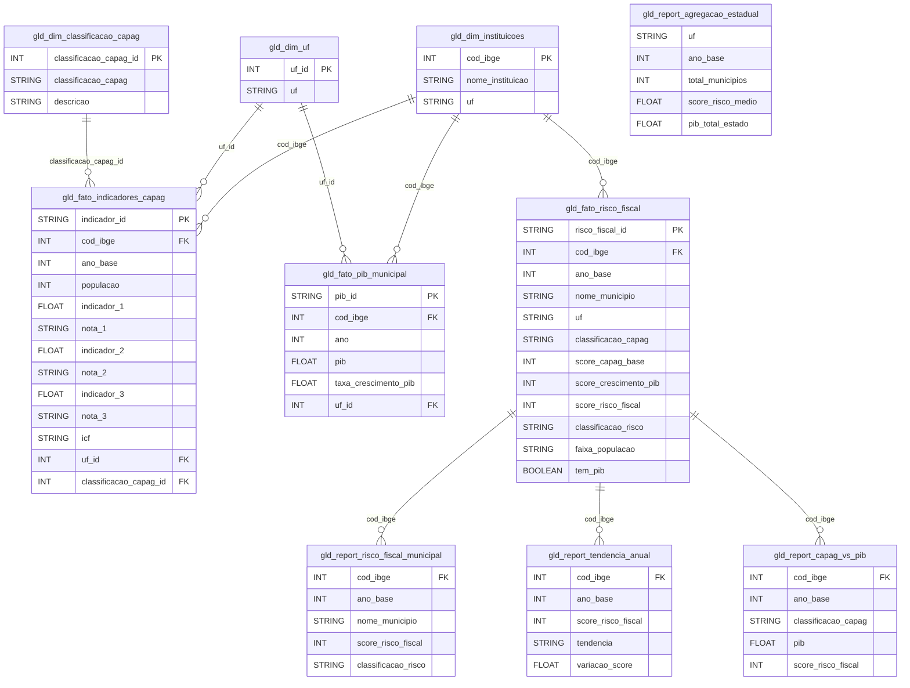
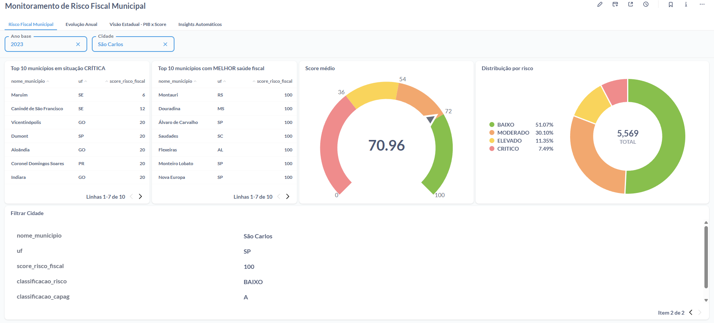
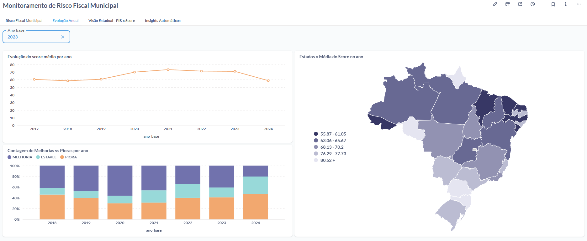
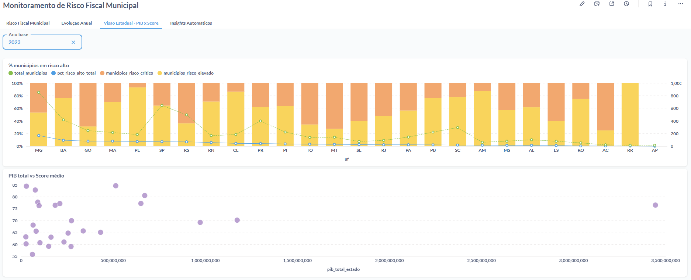
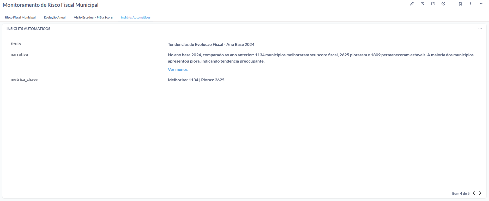

# Sistema de Monitoramento de Risco Fiscal Municipal

## Sumário

1. [Objetivo do Projeto](#1-objetivo-do-projeto)
2. [Arquitetura de Solução](#2-arquitetura-de-solução)
3. [Fontes de Dados](#3-fontes-de-dados)
4. [Arquitetura Medalhão](#4-arquitetura-medalhão-bronze--silver--gold)
5. [Pipeline de Dados](#5-pipeline-de-dados)
6. [Validação de Qualidade](#6-validação-de-qualidade-dbt-tests)
7. [Insights Automáticos](#7-insights-automáticos)
8. [Dashboards no Metabase](#8-dashboards-no-metabase)
9. [Infraestrutura como Código](#9-infraestrutura-como-código-terraform)
10. [CI/CD](#10-cicd-github-actions)
11. [Reprodução do Projeto](#11-reprodução-do-projeto)
12. [Stack Tecnológica](#12-stack-tecnológica)
13. [Melhorias Futuras e Considerações Finais](#13-melhorias-futuras-e-considerações-finais)

---

## 1. Objetivo do Projeto

Este projeto implementa um **Sistema de Monitoramento de Risco Fiscal Municipal**, cruzando dados de **CAPAG** (Capacidade de Pagamento — Tesouro Nacional) com o **PIB Municipal** (IBGE) para avaliar a saúde fiscal dos municípios brasileiros.

O sistema gera um **score de risco fiscal composto (0–100)** que combina a classificação CAPAG (até 70 pts — já consolida endividamento, poupança corrente e liquidez) com o crescimento do PIB municipal (até 30 pts), classificando cada município em: **BAIXO**, **MODERADO**, **ELEVADO**, **CRÍTICO** ou **INDETERMINADO** (quando não há dados suficientes).

### O que é CAPAG?

O processo CAPAG (Capacidade de Pagamento) é um sistema de avaliação da Secretaria do Tesouro Nacional (STN) que analisa a situação fiscal dos estados e municípios. Avalia três indicadores e, a partir de 2024, incorpora também o ICF:

| Indicador | O que mede | Critério |
| --- | --- | --- |
| Indicador 1 | Endividamento (DC/RCL) | Menor = melhor |
| Indicador 2 | Poupança Corrente | Maior = melhor |
| Indicador 3 | Liquidez | Acima de 1 = adequado |
| ICF | Qualidade da Informação Contábil e Fiscal | Ranking Siconfi |

> **Nota sobre o ICF (a partir de 2024):** O ICF (Índice de Qualidade da Informação Contábil e Fiscal) é a nota obtida pelo município no [Ranking da Qualidade da Informação Contábil e Fiscal no Siconfi](https://ranking-municipios.tesouro.gov.br/). A partir de 2024, a classificação final da CAPAG passou a considerar não apenas as notas 1, 2 e 3, mas também o ICF. Isso significa que municípios com baixa qualidade de informação contábil podem ter sua nota CAPAG rebaixada. Para anos anteriores a 2024 (ano_base < 2023), esta coluna é nula, pois o indicador não existia.

### O que é PIB Municipal?

O **PIB (Produto Interno Bruto)** é o principal indicador econômico de um país, estado ou município. Ele representa a soma de todos os bens e serviços finais produzidos em uma determinada região durante um período (geralmente um ano). Em outras palavras, o PIB mede o "tamanho" da economia local — quanto maior o PIB, maior a atividade econômica daquele município.

Neste projeto, o PIB Municipal é utilizado como complemento à avaliação CAPAG: municípios com PIB em crescimento tendem a ter maior capacidade de geração de receita, o que contribui positivamente para o score de risco fiscal.

Os dados são obtidos do **IBGE** (tabela SIDRA 5938), que publica o PIB de todos os municípios brasileiros. O download é feito via API SIDRA, retornando o PIB a preços correntes, com cobertura de 2015 a 2023.

---

## 2. Arquitetura de Solução

### Diagrama do Pipeline


### Fluxo Detalhado

```
                    ┌──────────────────────────────────────┐
                    │        GitHub Actions (CI/CD)        │
                    │  ci.yml: dbt + Docker + Python lint  │
                    │  terraform.yml: plan (PR) / apply    │
                    └──────────────────┬───────────────────┘
                                       │
┌──────────────────────────────────────────────────────────────┐
│                  Terraform (infra/)                          │
│   Provisiona: GCS bucket + 6 datasets BigQuery + lifecycle   │
└──────────────────────────┬───────────────────────────────────┘
                           │ provisiona
                           ▼
┌─────────────────┐   ┌─────────────────┐   ┌─────────────────┐
│  dados.gov.br   │   │  IBGE / SIDRA   │   │ IBGE Localidades│
│  (CAPAG XLSX)   │   │  (PIB Municipal)│   │   (Municípios)  │
└────────┬────────┘   └────────┬────────┘   └────────┬────────┘
         │ download            │ download            │ download
         ▼                     ▼                     ▼
┌─────────────────────────────────────────────────────────────┐
│                   Google Cloud Storage                      │
│     (raw/capag.csv, raw/pib_municipal.csv, raw/cidades.csv) │
└──────────────────────────┬──────────────────────────────────┘
                           │ load
                           ▼
┌─────────────────────────────────────────┐
│              BigQuery                   │
│                                         │
│  ┌──────────┐ ┌──────────┐ ┌──────────┐ │
│  │  BRONZE  │→│  SILVER  │→│   GOLD   │ │
│  │  (views) │ │ (limpo)  │ │ (negócio)│ │
│  └──────────┘ └──────────┘ └──────────┘ │
│     ↑ dbt test  ↑ dbt test   ↑ dbt test │
└────────────────┬────────────────────────┘
                 │
        ┌────────┴────────┐
        ▼                 ▼
┌──────────────┐  ┌──────────────┐
│   Metabase   │  │   Insights   │
│  Dashboards  │  │  Automáticos │
└──────────────┘  └──────────────┘
```

### Infraestrutura e CI/CD

- **Terraform:** toda a infraestrutura GCP (bucket GCS + 6 datasets BigQuery) é provisionada como código. Detalhes na [Seção 9](#9-infraestrutura-como-código-terraform).
- **GitHub Actions:** validação automática de SQL, Docker e infraestrutura a cada envio de código. Detalhes na [Seção 10](#10-cicd-github-actions).

### Orquestração

O **Apache Airflow** é o orquestrador que coordena a execução de todas as etapas do pipeline na ordem correta. O fluxo resumido é:

```
Download das 3 fontes (em paralelo)
    → Upload dos arquivos para o Google Cloud Storage (em paralelo)
    → Carga dos dados brutos no BigQuery
    → Transformação Bronze (3 views) → Testes de qualidade
    → Transformação Silver (5 tabelas) → Testes de qualidade
    → Transformação Gold (10 tabelas) → Testes de qualidade
    → Geração de Insights Automáticos
```

**Resiliência do pipeline:**

O pipeline foi configurado para lidar com falhas comuns (como indisponibilidade temporária das APIs externas) de forma automática, sem necessidade de intervenção manual:

- **Retentativas automáticas:** por padrão, cada task tenta executar até 2 vezes caso falhe, com um intervalo de 2 minutos entre as tentativas. Para as tasks de download (que dependem de APIs externas e são mais suscetíveis a falhas de rede), são permitidas até 3 tentativas, com intervalo de 3 minutos.
- **Limites de tempo (timeouts):** cada task tem um tempo máximo de execução de 60 minutos. Tasks de download possuem um limite mais curto de 30 minutos, pois caso a API não responda nesse tempo, provavelmente está fora do ar. O pipeline completo tem um limite total de 4 horas.
- **Execução única:** apenas uma execução da DAG pode rodar por vez (`max_active_runs=1`), evitando que execuções concorrentes disputem os mesmos recursos ou gerem dados duplicados.
- **Notificação de falhas:** em caso de erro, um callback registra logs estruturados com detalhes da falha (task, horário, mensagem de erro), facilitando o diagnóstico. Esse mecanismo pode ser estendido para enviar notificações via Slack ou e-mail.

**Download incremental:**

Para evitar reprocessamento desnecessário a cada execução, os scripts de download são inteligentes: antes de baixar, eles verificam quais anos já existem no Google Cloud Storage (via `gcs_utils.py`) ou no arquivo CSV local. Apenas dados de anos novos são baixados e adicionados ao arquivo existente. Isso economiza tempo e recursos, especialmente em execuções recorrentes.

---

## 3. Fontes de Dados

| Fonte | Origem | Frequência de atualização | Download |
| --- | --- | --- | --- |
| CAPAG | dados.gov.br (Tesouro Nacional) | Quadrimestral (a cada 4 meses) | Automático via API (XLSX → CSV) |
| Cidades | IBGE API Localidades | Relativamente estático | Automático via API |
| PIB Municipal | IBGE SIDRA (tabela 5938) | Anual | Automático via API SIDRA |

### Estrutura do CAPAG (13 colunas)

| Coluna | Descrição |
| --- | --- |
| INSTITUICAO | Nome do município |
| COD_IBGE | Código IBGE (7 dígitos) |
| UF | Unidade Federativa |
| POPULACAO | População do município |
| INDICADOR_1 / NOTA_1 | Endividamento (DC/RCL) e classificação |
| INDICADOR_2 / NOTA_2 | Poupança corrente e classificação |
| INDICADOR_3 / NOTA_3 | Liquidez e classificação |
| CLASSIFICACAO_CAPAG | Nota geral (A, B, C, D) |
| ICF | Ranking da Qualidade da Informação Contábil e Fiscal no Siconfi (a partir de 2024, nulo para anos anteriores) |
| ANO_BASE | Ano base dos dados |

### Estrutura do PIB Municipal (5 colunas)

| Coluna | Descrição |
| --- | --- |
| ano | Ano de referência |
| cod_ibge | Código IBGE do município |
| nome_municipio | Nome do município |
| uf | Sigla da UF |
| pib | PIB total a preços correntes (R$ x 1000) |

### Estrutura de Cidades (4 colunas)

| Coluna | Descrição |
| --- | --- |
| Id | Sequencial |
| Codigo | Código IBGE do município |
| Nome | Nome do município |
| UF | Sigla da UF |

---

## 4. Arquitetura Medalhão

### Bronze (dataset: `bronze`) — 3 views

A camada Bronze contém views que espelham os dados brutos exatamente como foram carregados nas tabelas raw do BigQuery (vindas do GCS), servindo como ponto de partida rastreável para as transformações seguintes.

| Modelo | Fonte dos dados |
| --- | --- |
| `brz_capag_brasil` | Tabela bruta de CAPAG |
| `brz_cidades_brasil` | Tabela bruta de municípios |
| `brz_pib_municipal` | Tabela bruta de PIB Municipal |

### Silver (dataset: `silver`) — 5 tabelas
Dados limpos, tipados, deduplicados e validados. São as tabelas "confiáveis" do projeto — qualquer análise deve partir daqui ou da camada Gold. Particionados por ano quando aplicável.

| Modelo | Descrição | Partição |
| --- | --- | --- |
| `slv_capag_municipios` | CAPAG limpo: conversão segura de tipos de dados, remoção de registros duplicados (por cod_ibge + ano_base), tratamento de valores inválidos (como `n.d.`) convertidos para nulo, e geração de chave única para cada registro | ano_base |
| `slv_cidades` | Municípios com remoção de duplicatas por código IBGE (mantém apenas um registro por município) | — |
| `slv_pib_municipal` | PIB limpo, com remoção de duplicatas (em caso de duplicata, mantém o registro com maior PIB), e geração de chave única para cada registro | ano |
| `slv_dim_uf` | Tabela de referência das Unidades Federativas: consolida todas as UFs presentes nos dados de CAPAG e de cidades, eliminando repetições e atribuindo um identificador numérico único para cada UF | — |
| `slv_dim_classificacao_capag` | Tabela de referência das classificações CAPAG (A, B, C, D) com suas descrições por extenso (ex.: "A — Boa capacidade de pagamento"), atribuindo um identificador numérico único para cada classificação | — |

### Gold (dataset: `gold`) — 10 tabelas
Modelos de negócio prontos para consumo analítico e dashboards.

#### Dimensões (3 tabelas)

Tabelas de referência ("cadastros") que descrevem as entidades do modelo e são usadas pelas tabelas de fatos para enriquecer as análises:

| Modelo | Descrição |
| --- | --- |
| `gld_dim_instituicoes` | Cadastro completo de municípios (nome, código IBGE, UF). Combina os dados de cidades e de CAPAG de forma a não perder nenhum município, mesmo que ele apareça em apenas uma das fontes. |
| `gld_dim_uf` | Cadastro das 27 Unidades Federativas, com identificador numérico único |
| `gld_dim_classificacao_capag` | Cadastro das classificações CAPAG (A, B, C, D) com suas descrições por extenso |

#### Fatos (3 tabelas)
| Modelo | Descrição | Partição | Cluster |
| --- | --- | --- | --- |
| `gld_fato_indicadores_capag` | Indicadores CAPAG por município/ano, com chaves estrangeiras (FKs) que conectam às tabelas de dimensão (UF e classificação) | ano_base (range 2015–2030) | uf_id, classificacao_capag_id |
| `gld_fato_pib_municipal` | PIB de cada município com cálculo da taxa de crescimento ano a ano (Year over Year), comparando o PIB atual com o do ano anterior | ano (range 2002–2030) | uf_id |
| `gld_fato_risco_fiscal` | **MODELO PRINCIPAL**: cruza dados de CAPAG com PIB, calcula o score de risco fiscal (0–100), classifica o nível de risco e categoriza por faixa populacional | ano_base (range 2015–2030) | classificacao_risco, uf |

#### Reports (4 tabelas pré-calculadas para Metabase)

Estas tabelas são versões pré-calculadas e otimizadas para consumo direto pelos dashboards do Metabase, evitando que consultas complexas sejam executadas a cada visualização:

| Modelo | Finalidade |
| --- | --- |
| `gld_report_risco_fiscal_municipal` | Visão detalhada por município: score, classificação, indicadores e PIB |
| `gld_report_tendencia_anual` | Evolução ano a ano: compara o score de cada município com o ano anterior e classifica a tendência (MELHORIA, PIORA, ESTAVEL ou SEM_HISTORICO) |
| `gld_report_capag_vs_pib` | Correlação entre classificação CAPAG e PIB — inclui apenas municípios que possuem dados de PIB |
| `gld_report_agregacao_estadual` | Visão consolidada por estado: total de municípios, score médio, percentual em risco alto e PIB total do estado |

#### Insights (tabela gerada por Python)
| Modelo | Descrição |
| --- | --- |
| `insights_risco_fiscal` | Narrativas automáticas geradas pelo agente de insights (6 tipos) |

### Modelagem de Dados — Camada Gold



### Score de Risco Fiscal (0–100 pontos)

O score combina dois componentes independentes. Quando apenas um componente está disponível, ele é reescalado para 0–100. Quando nenhum está disponível, o score é NULL e a classificação é INDETERMINADO.

| Componente | Peso | Critério |
| --- | --- | --- |
| Classificação CAPAG | 0–70 pts | A=70, B=50, C=25, D=0 — já consolida endividamento, poupança corrente e liquidez |
| Crescimento PIB | 0–30 pts | ≥10%=30, ≥5%=24, ≥2%=18, ≥0%=12, <0%=6, nulo/sem PIB=0 |

**Comportamento adaptativo do score:**

O score se adapta à disponibilidade de dados de cada município:

- **Ambos disponíveis (CAPAG + PIB):** o score é a soma direta dos dois componentes, variando de 0 a 100.
- **Apenas CAPAG disponível:** o score do CAPAG (que vai até 70) é reescalado proporcionalmente para a faixa de 0 a 100, permitindo uma classificação mesmo sem dados de PIB.
- **Apenas PIB disponível:** o score do PIB (que vai até 30) é reescalado proporcionalmente para a faixa de 0 a 100.
- **Nenhum disponível:** o município recebe classificação INDETERMINADO, indicando ausência de dados suficientes para avaliação.

| Classificação | Score |
| --- | --- |
| BAIXO | ≥ 72 |
| MODERADO | ≥ 54 |
| ELEVADO | ≥ 36 |
| CRÍTICO | < 36 |
| INDETERMINADO | NULL (sem dados) |

---

## 5. Pipeline de Dados

### DAG principal: `capag`

**Arquivo:** `dags/capag.py`

**Tags:** `capag`, `pib`, `risco_fiscal`

**Fluxo detalhado:**

1. **Download automático** (3 tasks em paralelo, retries=2, timeout=30min cada)
   - `download_capag_files()` → API dados.gov.br → XLSX → consolida em CAPAG.csv (incremental por ano)
   - `download_pib_files()` → API SIDRA/IBGE tabela 5938 → PIB_MUNICIPAL.csv (incremental por ano)
   - `download_cidades_file()` → API IBGE Localidades → cidades.csv

2. **Upload para GCS** (3 tasks em paralelo)
   - `upload_capag_to_gcs` → gs://bruno_dm/raw/capag.csv
   - `upload_cidades_to_gcs` → gs://bruno_dm/raw/cidades.csv
   - `upload_pib_to_gcs` → gs://bruno_dm/raw/pib_municipal.csv

3. **Verificação de datasets** no BigQuery: verifica se os 6 datasets (capag, cidades, pib, bronze, silver, gold) existem no BigQuery. Eles já foram criados previamente pelo Terraform, mas essa verificação serve como garantia adicional — caso algum dataset não exista por qualquer motivo, ele é criado automaticamente.

4. **Carga raw** (GCS → BigQuery) — os arquivos CSV do GCS são carregados nas tabelas brutas do BigQuery, substituindo completamente os dados anteriores a cada execução
   - capag_brasil, cidades_brasil, pib_municipal

5. **Bronze** → Executa os modelos dbt da camada Bronze via DbtTaskGroup (um grupo de tasks do Airflow que executa automaticamente cada modelo dbt como uma task separada). Resultado: 3 views no BigQuery.

6. **Testes Bronze** → Executa os testes de qualidade dbt sobre os dados Bronze. Os testes rodam em um ambiente Python isolado dentro do container (dbt_venv), garantindo que as dependências do dbt não conflitem com as do Airflow.

7. **Silver** → Executa os modelos dbt da camada Silver via DbtTaskGroup. Resultado: 5 tabelas limpas e tipadas.

8. **Testes Silver** → Executa os testes de qualidade dbt sobre os dados Silver.

9. **Gold** → Executa os modelos dbt da camada Gold via DbtTaskGroup. Resultado: 10 tabelas de negócio (dimensões, fatos e reports).

10. **Testes Gold** → Executa os testes de qualidade dbt sobre os dados Gold.

11. **Insights automáticos** → Executa o script Python `generate_all_insights()`, que analisa os dados da camada Gold e gera narrativas em linguagem natural, salvando o resultado na tabela `gold.insights_risco_fiscal`.

**Encadeamento sequencial com bloqueio por falha:**

As etapas são executadas em sequência obrigatória: Bronze → Testes Bronze → Silver → Testes Silver → Gold → Testes Gold → Insights. Se qualquer teste de qualidade falhar com severidade `error`, o pipeline é interrompido e as etapas seguintes **não executam**, evitando que dados incorretos se propaguem para as camadas seguintes.

---

## 6. Validação de Qualidade

A validação de qualidade dos dados é feita com **dbt tests nativos**, executados automaticamente após cada camada do pipeline (Bronze, Silver e Gold). Os testes seguem uma política de severidade em dois níveis:

- **Severidade `error` (bloqueia o pipeline):** indica problemas críticos — por exemplo, tabelas vazias ou campos obrigatórios nulos. Quando um teste desse tipo falha, o pipeline é interrompido e as camadas seguintes não são processadas, evitando que dados corrompidos se propaguem.
- **Severidade `warn` (apenas alerta):** indica problemas de qualidade que merecem atenção, mas não impedem o uso dos dados — por exemplo, um valor de PIB negativo ou uma UF não reconhecida. O pipeline continua normalmente, e o alerta fica registrado nos logs para investigação posterior.

### Testes por camada

Os testes são de dois tipos:
- **Generic:** testes reutilizáveis do dbt, configurados diretamente no YAML (como `not_null`, `unique`, `accepted_values`, `relationships`). Basta declarar qual coluna e qual validação, sem escrever SQL.
- **Singular SQL:** testes escritos como queries SQL customizadas em arquivos `.sql` separados (pasta `tests/`), usados para validações específicas que os testes genéricos não cobrem (ex.: verificar se uma tabela tem ao menos 1 registro).

**Bronze** (dados brutos — `_bronze__models.yml`):
| Teste | Tipo | Severidade |
| --- | --- | --- |
| Tabelas CAPAG e PIB não-vazias | Singular SQL | error |
| cod_ibge not null (capag, pib) | Generic | error |
| instituicao not null (capag) | Generic | error |
| ano_base / ano not null | Generic | error |
| codigo not null (cidades) | Generic | error |

**Silver** (dados limpos — `_silver__models.yml`):
| Teste | Tipo | Severidade |
| --- | --- | --- |
| Tabelas CAPAG e PIB não-vazias | Singular SQL | error |
| Chaves (capag_sk, pib_sk) únicas e não-nulas | Generic | error |
| cod_ibge, ano_base, uf not null | Generic | error |
| uf_id, classificacao_capag_id unique e not null (dims) | Generic | error |
| UF válida (27 estados) | Generic (accepted_values) | warn |
| PIB ≥ 0 | Generic (accepted_range) | warn |

**Gold** (modelos de negócio — `_gold__models.yml`):
| Teste | Tipo | Severidade |
| --- | --- | --- |
| Tabela de risco fiscal não-vazia | Singular SQL | error |
| risco_fiscal_id, indicador_id, pib_id únicos e não-nulos | Generic | error |
| cod_ibge not null (fatos) | Generic | error |
| cod_ibge unique (dim_instituicoes) | Generic | error |
| Score entre 0 e 100 | Generic (accepted_range) | warn |
| Classificação de risco válida (BAIXO/MODERADO/ELEVADO/CRITICO/INDETERMINADO) | Generic (accepted_values) | warn |
| Classificação CAPAG válida (A/B/C/D) | Generic (accepted_values) | — |
| FK uf_id existe na gld_dim_uf | Generic (relationships) | warn |
| FK classificacao_capag_id existe na gld_dim_classificacao_capag | Generic (relationships) | warn |
| PIB ≥ 0 (fato_pib_municipal) | Generic (accepted_range) | warn |
| Tendência válida (MELHORIA/PIORA/ESTAVEL/SEM_HISTORICO) | Generic (accepted_values) | warn |

---

## 7. Insights Automáticos

Gera **6 tipos de insights** em linguagem natural, consultando diretamente as tabelas da camada Gold no BigQuery. O resultado é salvo na tabela `gold.insights_risco_fiscal`, que é completamente recriada a cada execução (os insights anteriores são substituídos pelos mais recentes):

| Tipo | Prioridade | Insight |
| --- | --- | --- |
| `resumo_geral` | 1 | Panorama fiscal: total de municípios, score médio, distribuição por faixa de risco |
| `alerta_risco` | 2 | Top 10 municípios em situação CRÍTICA (menor score) |
| `destaque_positivo` | 3 | Top 10 municípios com melhor saúde fiscal (maior score, classificação BAIXO) |
| `analise_regional` | 4 | Top 10 estados com maior % de municípios em risco alto (ELEVADO + CRÍTICO) |
| `tendencia` | 5 | Evolução ano a ano: quantos municípios melhoraram vs pioraram em relação ao ano anterior |
| `correlacao` | 6 | Análise de risco por faixa populacional: % em risco crítico por porte |

---

## 8. Dashboards no Metabase

O **Metabase** é a ferramenta de visualização de dados utilizada neste projeto. Ele roda localmente como um container Docker na porta 3000 e se conecta diretamente ao BigQuery para consumir as tabelas da camada Gold. O Metabase já é iniciado automaticamente junto com o Airflow ao executar o comando `astro dev start` — não é necessário instalar ou configurar nada separadamente.

> **Todas as queries SQL dos dashboards estão documentadas em [`include/metabase-data/queries_metabase.sql`](include/metabase-data/queries_metabase.sql)**, com comentários sobre o tipo de visualização e filtros recomendados para cada card.

### Passo a passo para criar os dashboards

1. **Conectar ao BigQuery** (pré-requisito — feito uma vez):
   - Acesse http://localhost:3000
   - Vá em **Admin** → **Databases** → **Add Database**
   - Selecione **BigQuery**, aponte para o projeto `projeto-data-master`
   - Após sincronizar, as tabelas do dataset `gold` estarão disponíveis

2. **Criar as Perguntas (Questions)** a partir das queries:
   - Clique em **"+ Novo"** → **"Pergunta SQL"**
   - Cole a query correspondente do arquivo `queries_metabase.sql`
   - Escolha a visualização adequada (indicado nos comentários da query)
   - Salve em uma coleção organizada (ex: `Risco Fiscal / [Nome do Dashboard]`)

3. **Montar o Dashboard**:
   - Clique em **"+ Novo"** → **"Dashboard"**
   - No modo edição, clique **"+"** para adicionar as perguntas salvas
   - Adicione filtros: UF, Ano, Classificação de Risco
   - Conecte cada filtro às colunas correspondentes nas perguntas

4. **Layout recomendado**:
   - KPIs (números/gauges) → topo
   - Gráficos de distribuição → meio
   - Tabelas detalhadas → parte inferior

### Dashboard 1: Painel de Risco Fiscal Municipal



- **Fonte:** `gold.gld_report_risco_fiscal_municipal`
- **Filtros:** UF, Ano, Classificação de Risco, Faixa Populacional
- **Cards:**
  - Distribuição por risco (pizza) — query 1.1
  - Score médio nacional (gauge 0–100) — query 1.2
  - Top 10 maior risco (tabela) — query 1.3
  - Top 10 menor risco (tabela) — query 1.4
  - Busca por município individual (tabela) — query 1.5

### Dashboard 2: Tendências Anuais



- **Fonte:** `gold.gld_report_tendencia_anual`
- **Cards:**
  - Evolução do score médio por ano (gráfico de linha) — query 2.1
  - Melhorias vs Pioras por ano (barras empilhadas) — query 2.2
  - Heatmap score médio por UF — query 2.3

### Dashboard 3: Visão Estadual — PIB × Score



- **Fonte:** `gold.gld_report_agregacao_estadual`
- **Cards:**
  - % municípios em risco alto/crítico por UF (barras horizontais) — query 3.1
  - PIB total do estado vs Score médio (scatter plot) — query 3.2

### Dashboard 4: Insights Automáticos



- **Fonte:** `gold.insights_risco_fiscal`
- **Card:** 
  - Narrativas automáticas ordenadas por prioridade (tabela formatada) — query 4.1

---

## 9. Infraestrutura como Código

### Por que Terraform?

Antes do Terraform, o bucket GCS e os datasets BigQuery eram criados **manualmente** pelo console do GCP ou diretamente pela DAG no Airflow. Isso gerava problemas:

| Problema (antes) | Solução (Terraform) |
| --- | --- |
| Infra criada manualmente, sem registro do que foi feito | Código versionado no Git — toda mudança é rastreável |
| Impossível recriar o ambiente de forma consistente | `terraform apply` recria tudo identicamente em qualquer projeto GCP |
| Risco de esquecer recursos ao migrar de projeto | Todos os recursos declarados em um único lugar (`main.tf`) |
| Sem lifecycle policies no GCS | Nearline automático após 90 dias + deleção de versões antigas (boas práticas de governança) |
| Datasets criados sem labels ou padrão | Labels padronizados por camada (`raw`, `bronze`, `silver`, `gold`) |
| Mudanças de infra sem revisão | CI/CD: `terraform plan` em PRs, `apply` apenas em merge na main |

Toda a infraestrutura GCP é provisionada e versionada via **Terraform** no diretório `infra/`.

### Recursos provisionados

| Recurso | Descrição |
| --- | --- |
| `google_storage_bucket.raw_data` | Bucket GCS (`bruno_dm`) com versionamento habilitado e lifecycle policies |
| `google_bigquery_dataset.capag` | Dataset raw para dados CAPAG |
| `google_bigquery_dataset.cidades` | Dataset raw para cadastro de municípios |
| `google_bigquery_dataset.pib` | Dataset raw para PIB Municipal |
| `google_bigquery_dataset.bronze` | Dataset Bronze — views espelhando dados brutos |
| `google_bigquery_dataset.silver` | Dataset Silver — dados limpos e tipados |
| `google_bigquery_dataset.gold` | Dataset Gold — modelos dimensionais e reports |

### Políticas de ciclo de vida (GCS)

O Google Cloud Storage cobra pelo armazenamento de dados (embora o volume deste projeto seja pequeno e os custos sejam mínimos). Para seguir boas práticas de governança e otimizar custos em cenários de maior escala, foram configuradas regras automáticas de ciclo de vida:

- **Migração automática após 90 dias:** arquivos que não são acessados com frequência são movidos automaticamente para uma classe de armazenamento mais econômica (Nearline), sem que nenhuma ação manual seja necessária.
- **Limpeza automática após 365 dias:** versões antigas dos arquivos são removidas automaticamente, mantendo apenas as 3 versões mais recentes para economizar espaço.

### Estrutura dos arquivos

```
infra/
├── main.tf          # Provider GCP, bucket GCS, datasets BigQuery
├── variables.tf     # Variáveis centralizadas (project_id, region, bucket_name)
└── outputs.tf       # Outputs após apply (URLs, dataset IDs)
```

### Comandos úteis

```bash
make infra-init     # terraform init (primeira vez)
make infra-plan     # terraform plan (mostra o que vai mudar)
make infra-apply    # terraform apply (aplica no GCP)
```

---

## 10. CI/CD

### Por que CI/CD?

Sem automação, erros em SQL, Python ou infraestrutura só seriam detectados **em produção** (ao rodar a DAG ou ao aplicar Terraform manualmente). O CI/CD garante:

- **Detecção precoce de erros:** a cada envio de código ao repositório, o sistema verifica automaticamente se os arquivos SQL estão corretos, se o código Python segue boas práticas e se a imagem Docker compila sem problemas — tudo isso antes de o código chegar ao Airflow em produção.
- **Revisão de infraestrutura:** quando alguém propõe mudanças nos arquivos de infraestrutura, o sistema gera automaticamente uma prévia do que seria alterado no Google Cloud, permitindo que a equipe revise antes de aprovar.
- **Deploy seguro:** as mudanças de infraestrutura só são aplicadas no Google Cloud após serem aprovadas e incorporadas à branch principal do repositório (nunca diretamente de uma branch de desenvolvimento).
- **Padronização:** todo código enviado ao repositório passa pelas mesmas verificações automáticas, independentemente de quem o escreveu.

O projeto conta com **dois workflows** de CI/CD configurados em `.github/workflows/`:

### Workflow 1: CI - Pipeline de Dados (`ci.yml`)

**Dispara em:** a cada envio de código ou abertura de Pull Request na branch `main` (ignora alterações em arquivos de infraestrutura, documentação e imagens).

Este workflow executa **3 verificações independentes em paralelo:**

**Verificação 1 — Validação SQL (dbt):**
Instala o dbt e verifica se todos os arquivos SQL e YAML dos modelos de dados estão com sintaxe correta, sem precisar se conectar ao BigQuery.

**Verificação 2 — Build Docker:**
Constrói a imagem Docker do projeto para validar que o Dockerfile e todas as dependências instalam corretamente, sem erros.

**Verificação 3 — Qualidade do código Python:**
Executa o flake8 (uma ferramenta de análise estática) sobre os scripts Python do projeto, verificando se seguem boas práticas de estilo e se não possuem erros comuns de programação.

### Workflow 2: Terraform - Infraestrutura (`terraform.yml`)

**Dispara em:** a cada envio de código ou abertura de Pull Request na branch `main`, **somente quando há alterações nos arquivos de infraestrutura** (pasta `infra/`).

Este workflow executa as seguintes etapas:

1. **Instalação e autenticação:** instala o Terraform e autentica no Google Cloud usando a credencial armazenada nos segredos (secrets) do repositório.
2. **Validação:** verifica se os arquivos de infraestrutura estão formatados corretamente e se a configuração é válida.
3. **Prévia das mudanças (em Pull Request):** exibe um relatório detalhado do que será criado, alterado ou removido no Google Cloud, sem aplicar nada — permitindo revisão pela equipe.
4. **Aplicação (após aprovação):** somente quando o código é incorporado à branch principal (merge), as mudanças são efetivamente aplicadas no Google Cloud.

### Segredos do repositório (Secrets)

Para que os workflows do **GitHub Actions** consigam acessar o Google Cloud automaticamente, é necessário configurar o seguinte segredo nas configurações do repositório GitHub (Settings → Secrets and variables → Actions):

| Secret | Descrição |
| --- | --- |
| `GCP_SA_KEY` | Conteúdo JSON da Service Account do Google Cloud, com permissões de administrador no BigQuery e no Cloud Storage |

> **Nota:** este segredo é necessário **apenas para o CI/CD** (GitHub Actions). Para rodar o projeto localmente, basta ter o arquivo `include/gcp/service_account.json` configurado conforme descrito na [Seção 11 — Reprodução do Projeto](#11-reprodução-do-projeto). Se você não pretende usar o CI/CD, pode ignorar esta configuração.

---

## 11. Reprodução do Projeto

### Pré-requisitos

| Requisito | Versão mínima | Verificar com |
| --- | --- | --- |
| Docker Desktop | 4.x | `docker --version` |
| Astro CLI | 1.x | `astro version` |
| Terraform | 1.7+ | `terraform --version` |
| Git | 2.x | `git --version` |
| Conta Google Cloud | — | Com BigQuery e GCS habilitados |
| RAM | 16 GB | — |

### Passo 1: Clonar o repositório

```bash
git clone https://github.com/camposbrets/DataMaster_F1RST.git
cd DataMaster_F1RST
```

### Passo 2: Configurar a Service Account do GCP

1. Acesse o [Console do Google Cloud](https://console.cloud.google.com/)
2. Crie um projeto (ou use existente) — anote o **Project ID**
3. Habilite as APIs:
   - BigQuery API
   - Cloud Storage API
4. Vá em **IAM e Admin** → **Service Accounts** → **Criar Service Account**
5. Atribua as roles:
   - **BigQuery Admin**
   - **Storage Admin**
6. Gere uma chave JSON e salve em:
   ```
   include/gcp/service_account.json
   ```

> **Segurança:** O arquivo `service_account.json` está no `.gitignore`. Cada pessoa que reproduzir o projeto deve gerar sua própria chave.

### Passo 3: Ajustar Project ID e Bucket (se necessário)

Se o seu Project ID for diferente de `projeto-data-master` ou o bucket for diferente de `bruno_dm`, altere nos arquivos:

| Arquivo | O que alterar |
| --- | --- |
| `include/dbt/profiles.yml` | Campo `project` |
| `include/dbt/models/sources/sources.yml` | Campo `database` em cada source |
| `dags/capag.py` | Variável `GCS_BUCKET` no topo do arquivo |
| `infra/variables.tf` | Defaults de `project_id` e `gcs_bucket_name` |

### Passo 4: Provisionar infraestrutura (Terraform)

```bash
# Inicializa o Terraform (primeira vez)
make infra-init

# Visualiza o que será criado (opcional, recomendado)
make infra-plan

# Aplica — cria o bucket GCS + 6 datasets BigQuery
make infra-apply
```

Ou manualmente:
```bash
cd infra && terraform init && terraform plan && terraform apply
```

**O que é criado automaticamente:**
- 1 bucket GCS com versionamento e lifecycle policies
- 6 datasets BigQuery: `capag`, `cidades`, `pib`, `bronze`, `silver`, `gold`

### Passo 5: Iniciar o ambiente (Airflow + Metabase)

```bash
# Certifique-se que o Docker Desktop está rodando, então:
astro dev start
# Ou: make airflow-start
```

Isso inicia todos os containers:
- **Airflow Webserver**: http://localhost:8080 (user: `admin`, senha: `admin`)
- **Metabase**: http://localhost:3000

> **Nota:** Na primeira vez, o build da imagem Docker pode levar alguns minutos (instala dbt_venv + dependências).

### Passo 6: Configurar conexão GCP no Airflow

1. Acesse http://localhost:8080 (user: `admin`, senha: `admin`)
2. Vá em **Admin** → **Connections** → **+** (Add Connection)
3. Preencha:
   - **Connection Id:** `gcp`
   - **Connection Type:** `Google Cloud`
   - **Keyfile Path:** `/usr/local/airflow/include/gcp/service_account.json`
4. Clique em **Save**

### Passo 7: Executar a DAG do pipeline

1. Na tela principal do Airflow, ative a DAG `capag`
2. Clique em **"Trigger DAG"** para executar
3. Acompanhe a execução na view **Graph**:

```
[Terraform já provisionou: GCS bucket + 6 datasets BigQuery]
                            ↓
download_capag ───→ upload_capag ──┐
                                   │
download_cidades ─→ upload_cidades ├──→ raw loads (3)
                                   │
download_pib ─────→ upload_pib ────┘
                            ↓
Bronze (3 views) → dbt test → Silver (5 tables) → dbt test → Gold (10 tables) → dbt test → Insights
```

### Passo 8: Configurar Metabase e criar dashboards

1. Acesse http://localhost:3000
2. Faça o cadastro inicial (crie conta de admin)
3. Conecte ao BigQuery:
   - Vá em **Admin** → **Databases** → **Add Database**
   - Tipo: **BigQuery**
   - Project ID: `projeto-data-master` (ou o seu)
   - Service Account JSON: cole o conteúdo do `service_account.json`
4. Aguarde a sincronização das tabelas (1–2 minutos)
5. Crie os dashboards usando as queries documentadas em:
   - **[`include/metabase-data/queries_metabase.sql`](include/metabase-data/queries_metabase.sql)** — contém todas as queries SQL com comentários sobre tipo de visualização, eixos e filtros recomendados

> **Detalhes completos sobre a criação de cada dashboard, cards e filtros estão na [Seção 8 — Dashboards no Metabase](#8-dashboards-no-metabase).**

### Passo 9: Verificar os resultados

Após a DAG completar com sucesso, valide:

| Verificação | Como |
| --- | --- |
| Dados no BigQuery | Console GCP → BigQuery → datasets bronze/silver/gold |
| Testes dbt ok | Airflow → logs das tasks `dbt_test_*` (0 failures) |
| Insights gerados | BigQuery → `gold.insights_risco_fiscal` |
| Dashboards | Metabase → http://localhost:3000 |

### Resumo dos comandos principais (Makefile)

```bash
make help              # Lista todos os comandos disponíveis
make setup             # Setup completo (Terraform + Airflow + Metabase)
make infra-init        # terraform init (primeira vez)
make infra-plan        # terraform plan (preview)
make infra-apply       # terraform apply (cria infra no GCP)
make airflow-start     # Inicia Airflow + Metabase via Docker
make airflow-stop      # Para os containers
make airflow-restart   # Reinicia os containers
make dbt-compile       # Valida SQL dos modelos dbt (sem executar)
make dbt-docs          # Gera e abre documentação do dbt
```

### Comandos para parar/limpar o ambiente

```bash
# Parar os containers (preserva dados)
astro dev stop
# Ou: make airflow-stop

# Destruir infraestrutura GCP (CUIDADO — remove bucket e datasets)
make infra-destroy
```

---

## 12. Stack Tecnológica

| Tecnologia | Versão | Uso |
| --- | --- | --- |
| **Docker** | — | Containerização do ambiente |
| **Astro CLI / Runtime** | 8.8.0 | Gerenciamento do Airflow |
| **Apache Airflow** | 2.x (TaskFlow API) | Orquestração do pipeline |
| **astronomer-cosmos** | 1.0.3 | Integração Airflow ↔ dbt (DbtTaskGroup) |
| **Google Cloud Storage** | — | Armazenamento dos arquivos CSV (raw layer) |
| **BigQuery** | — | Data warehouse (datasets: capag, cidades, pib, bronze, silver, gold) |
| **dbt-bigquery** | 1.5.3 | Transformação (Arquitetura Medalhão) + testes de qualidade |
| **dbt-utils** | 1.1.1 | Macros auxiliares (generate_surrogate_key, accepted_range) |
| **Terraform** | 1.7.0 | Infraestrutura como Código (GCS bucket, BigQuery datasets) |
| **GitHub Actions** | — | CI/CD (validação dbt + deploy Terraform) |
| **Metabase** | 0.50.24 | Dashboards interativos |
| **Python** | — | Download automático, geração de insights |
| **openpyxl** | — | Leitura de XLSX (CAPAG) |
| **requests** | — | Chamadas HTTP às APIs (dados.gov.br, SIDRA, IBGE) |
| **google-cloud-storage** | — | Upload de CSVs e verificação incremental no GCS |
| **Make** | — | Atalhos para comandos do projeto (`make infra-plan`, `make airflow-start`) |

### Estrutura do Projeto

```
DataMaster_F1RST/
├── dags/
│   └── capag.py                           # DAG principal
├── include/
│   ├── dataset/
│   │   ├── download_capag.py              # Download automático CAPAG (incremental)
│   │   ├── download_cidades.py            # Download automático municípios (API IBGE)
│   │   ├── download_pib.py                # Download automático PIB Municipal (incremental)
│   │   └── gcs_utils.py                   # Utils: verificação de anos no GCS
│   ├── dbt/
│   │   ├── dbt_project.yml                # Config medalhão (schemas, tags, materialização)
│   │   ├── profiles.yml                   # Conexão BigQuery
│   │   ├── packages.yml                   # dbt_utils 1.1.1
│   │   ├── cosmos_config.py               # Integração Airflow-dbt (ProfileConfig, ProjectConfig)
│   │   ├── macros/
│   │   │   └── generate_schema_name.sql   # Schema customizado por camada
│   │   ├── models/
│   │   │   ├── sources/sources.yml        # 3 fontes de dados
│   │   │   ├── bronze/                    # 3 views + _bronze__models.yml
│   │   │   ├── silver/                    # 5 tabelas + _silver__models.yml
│   │   │   └── gold/                      # 10 tabelas + _gold__models.yml
│   │   └── tests/                         # 5 testes singulares
│   ├── insights/
│   │   └── generate_insights.py           # Agente de insights automáticos
│   ├── metabase-data/
│   │   └── queries_metabase.sql           # Queries SQL para os dashboards do Metabase
│   └── gcp/
│       └── service_account.json           # Credenciais GCP (não commitado)
├── infra/
│   ├── main.tf                            # Provider GCP, bucket GCS, datasets BigQuery
│   ├── variables.tf                       # Variáveis centralizadas (project_id, region, bucket)
│   └── outputs.tf                         # Outputs (URLs, dataset IDs)
├── .github/workflows/
│   ├── ci.yml                             # CI: validação dbt (parse + deps)
│   └── terraform.yml                      # CD: Terraform plan (PR) / apply (merge)
├── Dockerfile                             # Astro Runtime 8.8.0 + dbt_venv
├── docker-compose.override.yml            # Metabase 0.50.24 (porta 3000)
├── Makefile                               # Atalhos: make infra-plan, make airflow-start, etc.
├── requirements.txt                       # Dependências Python
└── README.md                              # Este arquivo
```

---

## 13. Melhorias Futuras e Considerações Finais

### Melhorias propostas

1. **Integração com modelos preditivos de risco:**
   - Utilizar os dados históricos de score de risco fiscal para treinar modelos de machine learning capazes de prever a tendência futura de cada município, antecipando possíveis deteriorações fiscais antes que se tornem críticas.

2. **Alertas e monitoramento proativo:**
   - Implementar notificações automáticas (via Slack, e-mail ou Microsoft Teams) quando o pipeline detectar falhas, dados desatualizados ou municípios que tenham migrado para uma faixa de risco mais elevada entre uma execução e outra.

3. **Expansão das visualizações e análises:**
   - Adicionar mais tipos de visualizações no Metabase para aprofundar os insights, como mapas geográficos de calor por estado, análises temporais mais granulares e comparativos entre municípios de mesmo porte populacional.
   - Incluir filtros dinâmicos adicionais nos dashboards para permitir análises mais detalhadas e personalizadas.

4. **Inclusão de novas fontes de dados:**
   - Integrar outras fontes (como dados de receita tributária, transferências constitucionais e índices de desenvolvimento humano) para enriquecer o score de risco e gerar uma visão ainda mais completa da saúde fiscal municipal.

### Considerações finais

#### Evolução do projeto

Este projeto é uma evolução significativa do case anterior localizado no seguinte GitHub: https://github.com/BretsCampos/DATA_MASTER. 
As mudanças tiveram como objetivo transformar o pipeline original em uma solução robusta, escalável e alinhada com as boas práticas de engenharia de dados adotadas pelo mercado. A tabela abaixo resume as principais diferenças:

| Aspecto | Versão anterior | Versão atual |
| --- | --- | --- |
| **Fontes de dados** | 1 (CAPAG) | 3 (CAPAG + PIB Municipal + Cidades IBGE) |
| **Arquitetura dbt** | 2 camadas genéricas (transform + report) | 3 camadas Medalhão (Bronze + Silver + Gold) |
| **Modelos dbt** | 4 modelos | 18 modelos ativos (3 bronze + 5 silver + 10 gold) |
| **Testes de qualidade** | SODA (ferramenta externa, cloud pago) | dbt tests nativos (gratuito, integrado ao pipeline) |
| **DAG Airflow** | Sem retries | Com retries, timeouts, callback e download incremental |
| **Download de dados** | CSVs estáticos (download manual) | Automatizado via API com lógica incremental |
| **Score de risco** | Não existia | Score composto 0–100 com 5 classificações |
| **Insights automáticos** | Não existia | 6 tipos de narrativas em linguagem natural |
| **Infraestrutura** | Manual (Console GCP) | Terraform (Infrastructure as Code) |
| **CI/CD** | Não existia | GitHub Actions (validação dbt + deploy Terraform) |
| **Makefile** | Não existia | Atalhos para todos os comandos do projeto |

**Principais melhorias:**

1. **Arquitetura Medalhão:** a versão anterior usava 2 camadas genéricas em um único schema. A versão atual adota o padrão Medalhão (Bronze → Silver → Gold) com schemas separados no BigQuery, permitindo rastreabilidade completa — se um dado está errado na camada Gold, é possível rastrear se o problema veio da Bronze (dado bruto) ou da Silver (transformação).

2. **Análise multidimensional com PIB:** a versão anterior analisava apenas dados CAPAG isoladamente. A integração do PIB Municipal do IBGE permite cruzar saúde fiscal com contexto econômico — um município pode ter CAPAG "A", mas PIB estagnado, indicando risco futuro que não seria visível com uma análise unidimensional.

3. **Qualidade integrada ao pipeline:** a versão anterior usava o SODA como ferramenta externa de qualidade, que adicionava um ambiente virtualizado separado no Docker, credenciais extras e uma dependência paga (~US$ 300+/mês em ambiente cloud). A migração para dbt tests nativos eliminou essa dependência e integrou a qualidade diretamente ao fluxo de transformação.

4. **Download automatizado:** os CSVs estáticos da versão anterior exigiam download manual. Agora, 3 scripts consomem APIs públicas oficiais (dados.gov.br, SIDRA/IBGE, Localidades/IBGE) com lógica incremental — antes de baixar, verificam quais anos já existem e baixam apenas dados novos.

5. **Infraestrutura como Código:** o bucket GCS e os datasets BigQuery eram criados manualmente pelo Console do GCP. Com Terraform, toda a infraestrutura é provisionada com um único comando (`terraform apply`), versionada no Git e reprodutível em qualquer projeto GCP.

---

Este projeto demonstrou como é possível transformar dados públicos brutos — disponibilizados pelo Tesouro Nacional (CAPAG) e pelo IBGE (PIB Municipal) — em informações analíticas de alto valor por meio de um pipeline de dados moderno e bem estruturado.

A utilização de tecnologias como **BigQuery**, **dbt**, **Airflow**, **Terraform** e **Metabase** permitiu a criação de um sistema robusto, escalável e reprodutível para análise da saúde fiscal dos municípios brasileiros. A arquitetura Medalhão garantiu rastreabilidade e confiabilidade dos dados em cada etapa do processamento.

Através deste trabalho, foi possível compreender em profundidade o processo CAPAG e sua importância como ferramenta de avaliação fiscal, essencial para promover a responsabilidade fiscal e contribuir para a estabilidade econômica do país. As melhorias propostas acima visam aumentar a eficiência, a profundidade das análises e o valor entregue aos usuários finais.
