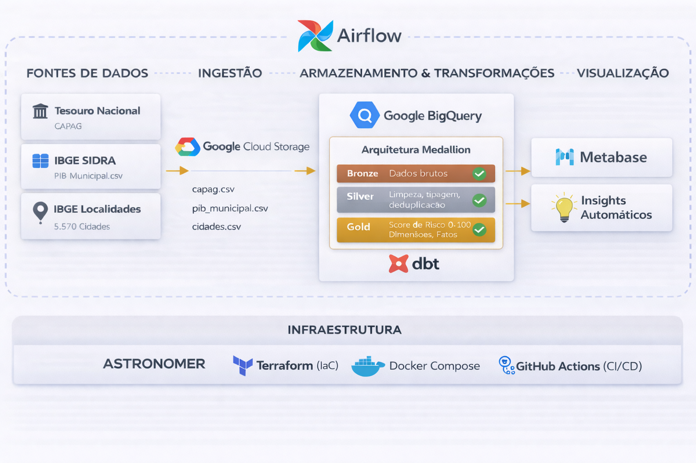
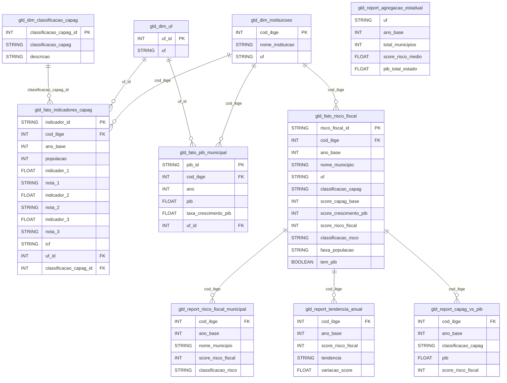
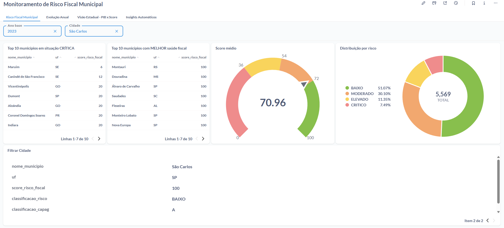
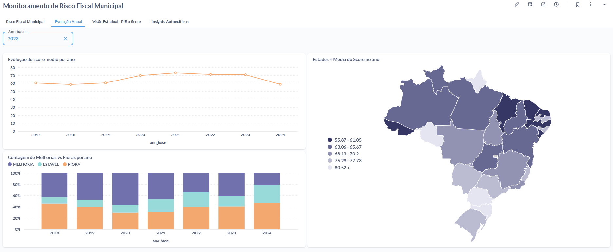
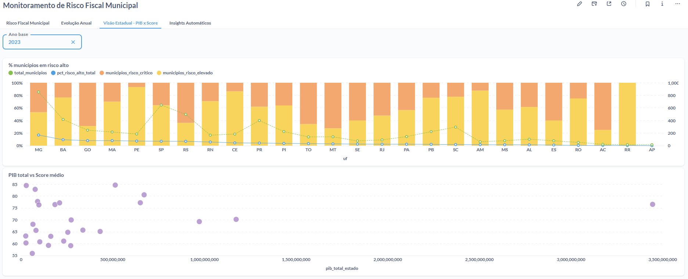
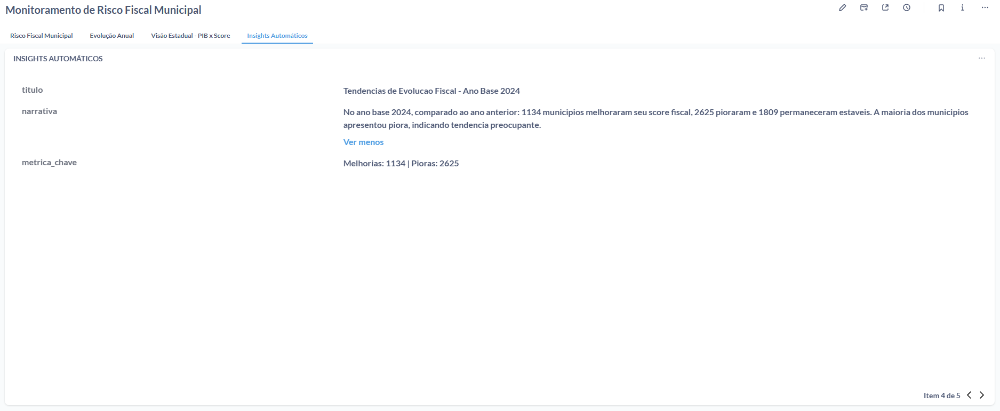

# Sistema de Monitoramento de Risco Fiscal Municipal

## Sumário

1. [Objetivo do Projeto](#1-objetivo-do-projeto)
2. [Arquitetura de Solução](#2-arquitetura-de-solução)
3. [Fontes de Dados](#3-fontes-de-dados)
4. [Arquitetura Medalhão](#4-arquitetura-medalhão-bronze--silver--gold)
5. [Pipeline de Dados](#5-pipeline-de-dados)
6. [Validação de Qualidade](#6-validação-de-qualidade-dbt-tests)
7. [Insights Automáticos](#7-insights-automáticos)
8. [Dashboards no Metabase](#8-dashboards-no-metabase)
9. [Infraestrutura como Código](#9-infraestrutura-como-código-terraform)
10. [CI/CD](#10-cicd-github-actions)
11. [Reprodução do Projeto](#11-reprodução-do-projeto)
12. [Stack Tecnológica](#12-stack-tecnológica)
13. [Melhorias Futuras e Considerações Finais](#13-melhorias-futuras-e-considerações-finais)

---

## 1. Objetivo do Projeto

Este projeto implementa um **Sistema de Monitoramento de Risco Fiscal Municipal**, cruzando dados de **CAPAG** (Capacidade de Pagamento — Tesouro Nacional) com o **PIB Municipal** (IBGE) para avaliar a saúde fiscal dos municípios brasileiros.

O sistema gera um **score de risco fiscal composto (0–100)** que combina a classificação CAPAG (até 70 pts — já consolida endividamento, poupança corrente e liquidez) com o crescimento do PIB municipal (até 30 pts), classificando cada município em: **BAIXO**, **MODERADO**, **ELEVADO**, **CRÍTICO** ou **INDETERMINADO** (quando não há dados suficientes).

### Atualizações recentes

As mudanças mais recentes do projeto foram concentradas em:

- provisionamento de infraestrutura com Terraform para GCS, BigQuery, IAM e recursos opcionais;
- automação de validação com GitHub Actions para dbt, Python e Terraform;
- parametrização do fluxo dbt para ambiente e configuração incremental;
- ajuste da camada Bronze para append-only, da Silver para incremental e deduplicada, e da Gold para a regra explícita de INDETERMINADO;
- hardening do Airflow para configuração por ambiente e notificação via Slack, além de ajustes no Metabase para chave de API e limites de memória.

### O que é CAPAG?

O processo CAPAG (Capacidade de Pagamento) é um sistema de avaliação da Secretaria do Tesouro Nacional (STN) que analisa a situação fiscal dos estados e municípios. Avalia três indicadores e, a partir de 2024, incorpora também o ICF:

| Indicador | O que mede | Critério |
| --- | --- | --- |
| Indicador 1 | Endividamento (DC/RCL) | Menor = melhor |
| Indicador 2 | Poupança Corrente | Maior = melhor |
| Indicador 3 | Liquidez | Acima de 1 = adequado |
| ICF | Qualidade da Informação Contábil e Fiscal | Ranking Siconfi |

> **Nota sobre o ICF (a partir de 2024):** O ICF (Índice de Qualidade da Informação Contábil e Fiscal) é a nota obtida pelo município no [Ranking da Qualidade da Informação Contábil e Fiscal no Siconfi](https://ranking-municipios.tesouro.gov.br/). A partir de 2024, a classificação final da CAPAG passou a considerar não apenas as notas 1, 2 e 3, mas também o ICF. Isso significa que municípios com baixa qualidade de informação contábil podem ter sua nota CAPAG rebaixada. Para anos anteriores a 2024 (ano_base < 2023), esta coluna é nula, pois o indicador não existia.

### O que é PIB Municipal?

O **PIB (Produto Interno Bruto)** é o principal indicador econômico de um país, estado ou município. Ele representa a soma de todos os bens e serviços finais produzidos em uma determinada região durante um período (geralmente um ano). Em outras palavras, o PIB mede o "tamanho" da economia local — quanto maior o PIB, maior a atividade econômica daquele município.

Neste projeto, o PIB Municipal é utilizado como complemento à avaliação CAPAG: municípios com PIB em crescimento tendem a ter maior capacidade de geração de receita, o que contribui positivamente para o score de risco fiscal.

Os dados são obtidos do **IBGE** (tabela SIDRA 5938), que publica o PIB de todos os municípios brasileiros. O download é feito via API SIDRA, retornando o PIB a preços correntes, com cobertura de 2015 a 2023.

---

## 2. Arquitetura de Solução

### Diagrama do Pipeline



### Fluxo Detalhado

```
                    ┌──────────────────────────────────────┐
                    │        GitHub Actions (CI/CD)        │
                    │  ci.yml: dbt + Docker + Python lint  │
                    │  terraform.yml: plan (PR) / apply    │
                    └──────────────────┬───────────────────┘
                                       │
┌──────────────────────────────────────────────────────────────┐
│                  Terraform (infra/)                          │
│   Provisiona: GCS bucket + 6 datasets BigQuery + lifecycle   │
└──────────────────────────┬───────────────────────────────────┘
                           │ provisiona
                           ▼
┌─────────────────┐   ┌─────────────────┐   ┌─────────────────┐
│  Tesouro Transp.│   │  IBGE / SIDRA   │   │ IBGE Localidades│
│  (CAPAG XLSX)   │   │  (PIB Municipal)│   │   (Municípios)  │
└────────┬────────┘   └────────┬────────┘   └────────┬────────┘
         │ download            │ download            │ download
         ▼                     ▼                     ▼
┌─────────────────────────────────────────────────────────────┐
│                   Google Cloud Storage                      │
│     (raw/capag.csv, raw/pib_municipal.csv, raw/cidades.csv) │
└──────────────────────────┬──────────────────────────────────┘
                           │ load
                           ▼
┌─────────────────────────────────────────┐
│              BigQuery                   │
│                                         │
│  ┌──────────┐ ┌──────────┐ ┌──────────┐ │
│  │  BRONZE  │→│  SILVER  │→│   GOLD   │ │
│  │  (views) │ │ (limpo)  │ │ (negócio)│ │
│  └──────────┘ └──────────┘ └──────────┘ │
│     ↑ dbt test  ↑ dbt test   ↑ dbt test │
└────────────────┬────────────────────────┘
                 │
        ┌────────┴────────┐
        ▼                 ▼
┌──────────────┐  ┌──────────────┐
│   Metabase   │  │   Insights   │
│  Dashboards  │  │  Automáticos │
└──────────────┘  └──────────────┘
```

### Infraestrutura e CI/CD

- **Terraform:** toda a infraestrutura GCP (bucket GCS + 6 datasets BigQuery) é provisionada como código. Detalhes na [Seção 9](#9-infraestrutura-como-código-terraform).
- **GitHub Actions:** validação automática de SQL, Docker e infraestrutura a cada envio de código. Detalhes na [Seção 10](#10-cicd-github-actions).
- **Parâmetros do fluxo:** a DAG e o projeto dbt passaram a ler valores de ambiente para projeto GCP, bucket, conexão do Airflow e webhook do Slack, deixando a execução mais portável entre ambientes.

### Orquestração

O **Apache Airflow** é o orquestrador que coordena a execução de todas as etapas do pipeline na ordem correta. O fluxo resumido é:

```
Download das 3 fontes (em paralelo)
    → Upload dos arquivos para o Google Cloud Storage (em paralelo)
    → Carga dos dados brutos no BigQuery
    → Transformação Bronze (3 views) → Testes de qualidade
    → Transformação Silver (5 tabelas) → Testes de qualidade
    → Transformação Gold (10 tabelas) → Testes de qualidade
    → Geração de Insights Automáticos
```

**Resiliência do pipeline:**

O pipeline foi configurado para lidar com falhas comuns (como indisponibilidade temporária das APIs externas) de forma automática, sem necessidade de intervenção manual:

- **Retentativas automáticas:** por padrão, cada task tenta executar até 2 vezes caso falhe, com um intervalo de 2 minutos entre as tentativas. Para as tasks de download (que dependem de APIs externas e são mais suscetíveis a falhas de rede), são permitidas até 3 tentativas, com intervalo de 3 minutos.
- **Limites de tempo (timeouts):** cada task tem um tempo máximo de execução de 60 minutos. Tasks de download possuem um limite mais curto de 30 minutos, pois caso a API não responda nesse tempo, provavelmente está fora do ar. O pipeline completo tem um limite total de 4 horas.
- **Execução única:** apenas uma execução da DAG pode rodar por vez (`max_active_runs=1`), evitando que execuções concorrentes disputem os mesmos recursos ou gerem dados duplicados.
- **Notificação de falhas:** em caso de erro, um callback registra logs estruturados com detalhes da falha (task, horário, mensagem de erro), facilitando o diagnóstico. Esse mecanismo pode ser estendido para enviar notificações via Slack ou e-mail.

**Download incremental:**

Para evitar reprocessamento desnecessário a cada execução, os scripts de download são inteligentes: antes de baixar, eles verificam quais anos já existem no Google Cloud Storage (via `gcs_utils.py`) ou no arquivo CSV local. Apenas dados de anos novos são baixados e adicionados ao arquivo existente. Isso economiza tempo e recursos, especialmente em execuções recorrentes.

---

## 3. Fontes de Dados

| Fonte | Origem | Frequência de atualização | Download |
| --- | --- | --- | --- |
| CAPAG | Tesouro Transparente (CKAN público) | Quadrimestral | Automático via API CKAN (XLSX → CSV) |
| Cidades | IBGE API Localidades | Relativamente estático | Automático via API |
| PIB Municipal | IBGE SIDRA (tabela 5938) | Anual | Automático via API SIDRA |

### Estrutura do CAPAG (13 colunas)

| Coluna | Descrição |
| --- | --- |
| INSTITUICAO | Nome do município |
| COD_IBGE | Código IBGE (7 dígitos) |
| UF | Unidade Federativa |
| POPULACAO | População do município |
| INDICADOR_1 / NOTA_1 | Endividamento (DC/RCL) e classificação |
| INDICADOR_2 / NOTA_2 | Poupança corrente e classificação |
| INDICADOR_3 / NOTA_3 | Liquidez e classificação |
| CLASSIFICACAO_CAPAG | Nota geral (A, B, C, D) |
| ICF | Ranking da Qualidade da Informação Contábil e Fiscal no Siconfi (a partir de 2024, nulo para anos anteriores) |
| ANO_BASE | Ano base dos dados |

### Estrutura do PIB Municipal (5 colunas)

| Coluna | Descrição |
| --- | --- |
| ano | Ano de referência |
| cod_ibge | Código IBGE do município |
| nome_municipio | Nome do município |
| uf | Sigla da UF |
| pib | PIB total a preços correntes (R$ x 1000) |

### Estrutura de Cidades (4 colunas)

| Coluna | Descrição |
| --- | --- |
| Id | Sequencial |
| Codigo | Código IBGE do município |
| Nome | Nome do município |
| UF | Sigla da UF |

### Nota — fonte do CAPAG

O **CAPAG é produzido pela Secretaria do Tesouro Nacional (STN)**, órgão responsável por avaliar a capacidade de pagamento dos entes subnacionais (atribuição vinculada ao processo de garantia da União para operações de crédito). O Tesouro publica os arquivos no portal **Tesouro Transparente** (`https://www.tesourotransparente.gov.br/ckan/dataset/capag-municipios`) via API CKAN padrão, sem necessidade de autenticação.

Em versões anteriores deste projeto, o consumo era feito pelo **`dados.gov.br`**. Entre abril e maio de 2026 esse portal passou a exigir uma **chave de acesso** para qualquer chamada à sua API — inclusive nos endpoints que antes eram abertos ao público —, o que adicionava fricção operacional (cadastro de perfil Consumidor no portal gov.br, gestão de token, possíveis bloqueios por aprovação pendente). A migração para a API do próprio órgão produtor elimina essa dependência sem alterar o código de leitura do XLSX (mesmo formato, mesma estrutura de recursos CKAN).

---

## 4. Arquitetura Medalhão

### Bronze (dataset: `bronze`) — 3 tabelas incrementais

A camada Bronze replica os dados brutos das tabelas raw do BigQuery adicionando uma coluna de metadado de ingestão. Cada execução do pipeline **acrescenta** novos registros sem sobrescrever os anteriores (`insert_overwrite` por partição de data), permitindo rastrear quando cada conjunto de dados chegou ao sistema.

Cada modelo Bronze adiciona a coluna `ingested_at` (`TIMESTAMP`) com o instante exato da execução, e a tabela é particionada por essa coluna com granularidade diária. Isso significa que cada execução do pipeline gera uma nova partição do dia, preservando o histórico completo de ingestões.

| Modelo | Fonte dos dados | Partição |
| --- | --- | --- |
| `brz_capag_brasil` | Tabela raw CAPAG | `ingested_at` (day) |
| `brz_cidades_brasil` | Tabela raw de municípios | `ingested_at` (day) |
| `brz_pib_municipal` | Tabela raw de PIB Municipal | `ingested_at` (day) |

### Silver (dataset: `silver`) — 5 tabelas
Dados limpos, tipados, deduplicados e validados. São as tabelas "confiáveis" do projeto — qualquer análise deve partir daqui ou da camada Gold.

Os dois modelos de dados principais (`slv_capag_municipios` e `slv_pib_municipal`) são materializados como **incrementais** com estratégia `merge` por chave única, particionados por ano. Eles reprocessam apenas os anos recentes a cada execução (janela de lookback configurável via variável `incremental_lookback_years`, padrão: 1 ano). As três tabelas de dimensão (`slv_cidades`, `slv_dim_uf`, `slv_dim_classificacao_capag`) são materializadas como **tabelas completas** (`table`), pois são pequenas e raramente mudam.

| Modelo | Materialização | Descrição | Partição |
| --- | --- | --- | --- |
| `slv_capag_municipios` | `incremental` (merge) | CAPAG limpo: conversão de tipos, remoção de duplicatas por `cod_ibge + ano_base`, tratamento de `n.d.` como nulo, chave única `capag_sk` | `ano_base` (int64, 2015–2030) |
| `slv_cidades` | `table` | Municípios deduplicados por código IBGE | — |
| `slv_pib_municipal` | `incremental` (merge) | PIB limpo, deduplicado (mantém maior PIB em caso de duplicata), chave única `pib_sk` | `ano` (int64, 2002–2030) |
| `slv_dim_uf` | `table` | Referência de Unidades Federativas com ID numérico único | — |
| `slv_dim_classificacao_capag` | `table` | Referência das classificações CAPAG (A–D) com descrição por extenso e ID numérico | — |

### Gold (dataset: `gold`) — 10 tabelas
Modelos de negócio prontos para consumo analítico e dashboards. A camada Gold recebeu ajustes para explicitar a regra de negócio em que municípios sem CAPAG válido são marcados como `INDETERMINADO`, preservando scores nulos nesse cenário e evitando classificações inconsistentes.

#### Dimensões (3 tabelas)

Tabelas de referência ("cadastros") que descrevem as entidades do modelo e são usadas pelas tabelas de fatos para enriquecer as análises:

| Modelo | Descrição |
| --- | --- |
| `gld_dim_instituicoes` | Cadastro completo de municípios (nome, código IBGE, UF). Combina os dados de cidades e de CAPAG de forma a não perder nenhum município, mesmo que ele apareça em apenas uma das fontes. |
| `gld_dim_uf` | Cadastro das 27 Unidades Federativas, com identificador numérico único |
| `gld_dim_classificacao_capag` | Cadastro das classificações CAPAG (A, B, C, D) com suas descrições por extenso |

#### Fatos (3 tabelas)
| Modelo | Descrição | Partição | Cluster |
| --- | --- | --- | --- |
| `gld_fato_indicadores_capag` | Indicadores CAPAG por município/ano, com chaves estrangeiras (FKs) que conectam às tabelas de dimensão (UF e classificação) | ano_base (range 2015–2030) | uf_id, classificacao_capag_id |
| `gld_fato_pib_municipal` | PIB de cada município com cálculo da taxa de crescimento ano a ano (Year over Year), comparando o PIB atual com o do ano anterior | ano (range 2002–2030) | uf_id |
| `gld_fato_risco_fiscal` | **MODELO PRINCIPAL**: cruza dados de CAPAG com PIB, calcula o score de risco fiscal (0–100), classifica o nível de risco e categoriza por faixa populacional | ano_base (range 2015–2030) | classificacao_risco, uf |

#### Reports (4 tabelas pré-calculadas para Metabase)

Estas tabelas são versões pré-calculadas e otimizadas para consumo direto pelos dashboards do Metabase, evitando que consultas complexas sejam executadas a cada visualização:

| Modelo | Finalidade |
| --- | --- |
| `gld_report_risco_fiscal_municipal` | Visão detalhada por município: score, classificação, indicadores e PIB |
| `gld_report_tendencia_anual` | Evolução ano a ano: compara o score de cada município com o ano anterior e classifica a tendência (MELHORIA, PIORA, ESTAVEL ou SEM_HISTORICO) |
| `gld_report_capag_vs_pib` | Correlação entre classificação CAPAG e PIB — inclui apenas municípios que possuem dados de PIB |
| `gld_report_agregacao_estadual` | Visão consolidada por estado: total de municípios, score médio, percentual em risco alto e PIB total do estado |

#### Insights (tabela gerada por Python)
| Modelo | Descrição |
| --- | --- |
| `insights_risco_fiscal` | Narrativas automáticas geradas pelo agente de insights (6 tipos) |

### Modelagem de Dados — Camada Gold


```mermaid
erDiagram
    gld_dim_classificacao_capag {
        INT classificacao_capag_id PK
        STRING classificacao_capag
        STRING descricao
    }

    gld_dim_uf {
        INT uf_id PK
        STRING uf
    }

    gld_dim_instituicoes {
        INT cod_ibge PK
        STRING nome_instituicao
        STRING uf
    }

    gld_fato_indicadores_capag {
        STRING indicador_id PK
        INT cod_ibge FK
        INT ano_base
        INT populacao
        FLOAT indicador_1
        STRING nota_1
        FLOAT indicador_2
        STRING nota_2
        FLOAT indicador_3
        STRING nota_3
        STRING icf
        INT uf_id FK
        INT classificacao_capag_id FK
    }

    gld_fato_pib_municipal {
        STRING pib_id PK
        INT cod_ibge FK
        INT ano
        FLOAT pib
        FLOAT taxa_crescimento_pib
        INT uf_id FK
    }

    gld_fato_risco_fiscal {
        STRING risco_fiscal_id PK
        INT cod_ibge FK
        INT ano_base
        STRING nome_municipio
        STRING uf
        STRING classificacao_capag
        INT score_capag_base
        INT score_crescimento_pib
        INT score_risco_fiscal
        STRING classificacao_risco
        STRING faixa_populacao
        BOOLEAN tem_pib
    }

    gld_report_risco_fiscal_municipal {
        INT cod_ibge FK
        INT ano_base
        STRING nome_municipio
        INT score_risco_fiscal
        STRING classificacao_risco
    }

    gld_report_tendencia_anual {
        INT cod_ibge FK
        INT ano_base
        INT score_risco_fiscal
        STRING tendencia
        FLOAT variacao_score
    }

    gld_report_agregacao_estadual {
        STRING uf
        INT ano_base
        INT total_municipios
        FLOAT score_risco_medio
        FLOAT pib_total_estado
    }

    gld_report_capag_vs_pib {
        INT cod_ibge FK
        INT ano_base
        STRING classificacao_capag
        FLOAT pib
        INT score_risco_fiscal
    }

    gld_dim_classificacao_capag ||--o{ gld_fato_indicadores_capag : "classificacao_capag_id"
    gld_dim_uf ||--o{ gld_fato_indicadores_capag : "uf_id"
    gld_dim_uf ||--o{ gld_fato_pib_municipal : "uf_id"
    gld_dim_instituicoes ||--o{ gld_fato_indicadores_capag : "cod_ibge"
    gld_dim_instituicoes ||--o{ gld_fato_pib_municipal : "cod_ibge"
    gld_dim_instituicoes ||--o{ gld_fato_risco_fiscal : "cod_ibge"
    gld_fato_risco_fiscal ||--o{ gld_report_risco_fiscal_municipal : "cod_ibge"
    gld_fato_risco_fiscal ||--o{ gld_report_tendencia_anual : "cod_ibge"
    gld_fato_risco_fiscal ||--o{ gld_report_capag_vs_pib : "cod_ibge"
```

### Score de Risco Fiscal (0–100 pontos)

O score combina dois componentes independentes. Quando apenas um componente está disponível, ele é reescalado para 0–100. Quando nenhum está disponível, o score é NULL e a classificação é INDETERMINADO.

| Componente | Peso | Critério |
| --- | --- | --- |
| Classificação CAPAG | 0–70 pts | A=70, B=50, C=25, D=0 — já consolida endividamento, poupança corrente e liquidez |
| Crescimento PIB | 0–30 pts | ≥10%=30, ≥5%=24, ≥2%=18, ≥0%=12, <0%=6, nulo/sem PIB=0 |

**Comportamento adaptativo do score:**

O score se adapta à disponibilidade de dados de cada município:

- **Ambos disponíveis (CAPAG + PIB):** o score é a soma direta dos dois componentes, variando de 0 a 100.
- **Apenas CAPAG disponível:** o score do CAPAG (que vai até 70) é reescalado proporcionalmente para a faixa de 0 a 100, permitindo uma classificação mesmo sem dados de PIB.
- **Apenas PIB disponível:** o score do PIB (que vai até 30) é reescalado proporcionalmente para a faixa de 0 a 100.
- **Nenhum disponível:** o município recebe classificação INDETERMINADO, indicando ausência de dados suficientes para avaliação.

| Classificação | Score |
| --- | --- |
| BAIXO | ≥ 72 |
| MODERADO | ≥ 54 |
| ELEVADO | ≥ 36 |
| CRÍTICO | < 36 |
| INDETERMINADO | NULL (sem dados) |

---

## 5. Pipeline de Dados

### DAG principal: `capag`

**Arquivo:** `dags/capag.py`

**Tags:** `capag`, `pib`, `risco_fiscal`

**Fluxo detalhado:**

1. **Download automático** (3 tasks em paralelo, retries=2, timeout=30min cada)
   - `download_capag_files()` → API CKAN do Tesouro Transparente → XLSX → consolida em CAPAG.csv (incremental por ano)
   - `download_pib_files()` → API SIDRA/IBGE tabela 5938 → PIB_MUNICIPAL.csv (incremental por ano)
   - `download_cidades_file()` → API IBGE Localidades → cidades.csv

2. **Upload para GCS** (3 tasks em paralelo)
   - `upload_capag_to_gcs` → gs://bruno_dm/raw/capag.csv
   - `upload_cidades_to_gcs` → gs://bruno_dm/raw/cidades.csv
   - `upload_pib_to_gcs` → gs://bruno_dm/raw/pib_municipal.csv

3. **Verificação de datasets** no BigQuery: verifica se os 6 datasets (capag, cidades, pib, bronze, silver, gold) existem no BigQuery. Eles já foram criados previamente pelo Terraform, mas essa verificação serve como garantia adicional — caso algum dataset não exista por qualquer motivo, ele é criado automaticamente.

4. **Carga raw** (GCS → BigQuery) — os arquivos CSV do GCS são carregados nas tabelas brutas do BigQuery, substituindo completamente os dados anteriores a cada execução
   - capag_brasil, cidades_brasil, pib_municipal

5. **Bronze** → Executa os modelos dbt da camada Bronze via DbtTaskGroup (um grupo de tasks do Airflow que executa automaticamente cada modelo dbt como uma task separada). Resultado: 3 views no BigQuery.

6. **Testes Bronze** → Executa os testes de qualidade dbt sobre os dados Bronze. Os testes rodam em um ambiente Python isolado dentro do container (dbt_venv), garantindo que as dependências do dbt não conflitem com as do Airflow.

7. **Silver** → Executa os modelos dbt da camada Silver via DbtTaskGroup. Resultado: 5 tabelas limpas e tipadas.

8. **Testes Silver** → Executa os testes de qualidade dbt sobre os dados Silver.

9. **Gold** → Executa os modelos dbt da camada Gold via DbtTaskGroup. Resultado: 10 tabelas de negócio (dimensões, fatos e reports).

10. **Testes Gold** → Executa os testes de qualidade dbt sobre os dados Gold.

11. **Insights automáticos** → Executa o script Python `generate_all_insights()`, que analisa os dados da camada Gold e gera narrativas em linguagem natural, salvando o resultado na tabela `gold.insights_risco_fiscal`.

**Encadeamento sequencial com bloqueio por falha:**

As etapas são executadas em sequência obrigatória: Bronze → Testes Bronze → Silver → Testes Silver → Gold → Testes Gold → Insights. Se qualquer teste de qualidade falhar com severidade `error`, o pipeline é interrompido e as etapas seguintes **não executam**, evitando que dados incorretos se propaguem para as camadas seguintes.

---

## 6. Validação de Qualidade

A validação de qualidade dos dados é feita com **dbt tests nativos**, executados automaticamente após cada camada do pipeline (Bronze, Silver e Gold). Os testes seguem uma política de severidade em dois níveis:

- **Severidade `error` (bloqueia o pipeline):** indica problemas críticos — por exemplo, tabelas vazias ou campos obrigatórios nulos. Quando um teste desse tipo falha, o pipeline é interrompido e as camadas seguintes não são processadas, evitando que dados corrompidos se propaguem.
- **Severidade `warn` (apenas alerta):** indica problemas de qualidade que merecem atenção, mas não impedem o uso dos dados — por exemplo, um valor de PIB negativo ou uma UF não reconhecida. O pipeline continua normalmente, e o alerta fica registrado nos logs para investigação posterior.

### Testes por camada

Os testes são de dois tipos:
- **Generic:** testes reutilizáveis do dbt, configurados diretamente no YAML (como `not_null`, `unique`, `accepted_values`, `relationships`). Basta declarar qual coluna e qual validação, sem escrever SQL.
- **Singular SQL:** testes escritos como queries SQL customizadas em arquivos `.sql` separados (pasta `tests/`), usados para validações específicas que os testes genéricos não cobrem (ex.: verificar se uma tabela tem ao menos 1 registro).

**Bronze** (dados brutos — `_bronze__models.yml`):
| Teste | Tipo | Severidade |
| --- | --- | --- |
| Tabelas CAPAG e PIB não-vazias | Singular SQL | error |
| cod_ibge not null (capag, pib) | Generic | error |
| instituicao not null (capag) | Generic | error |
| ano_base / ano not null | Generic | error |
| codigo not null (cidades) | Generic | error |

**Silver** (dados limpos — `_silver__models.yml`):
| Teste | Tipo | Severidade |
| --- | --- | --- |
| Tabelas CAPAG e PIB não-vazias | Singular SQL | error |
| Chaves (capag_sk, pib_sk) únicas e não-nulas | Generic | error |
| cod_ibge, ano_base, uf not null | Generic | error |
| uf_id, classificacao_capag_id unique e not null (dims) | Generic | error |
| UF válida (27 estados) | Generic (accepted_values) | warn |
| PIB ≥ 0 | Generic (accepted_range) | warn |

**Gold** (modelos de negócio — `_gold__models.yml`):
| Teste | Tipo | Severidade |
| --- | --- | --- |
| Tabela de risco fiscal não-vazia | Singular SQL | error |
| risco_fiscal_id, indicador_id, pib_id únicos e não-nulos | Generic | error |
| cod_ibge not null (fatos) | Generic | error |
| cod_ibge unique (dim_instituicoes) | Generic | error |
| Score entre 0 e 100 | Generic (accepted_range) | warn |
| Classificação de risco válida (BAIXO/MODERADO/ELEVADO/CRITICO/INDETERMINADO) | Generic (accepted_values) | warn |
| Classificação CAPAG válida (A/B/C/D) | Generic (accepted_values) | — |
| FK uf_id existe na gld_dim_uf | Generic (relationships) | warn |
| FK classificacao_capag_id existe na gld_dim_classificacao_capag | Generic (relationships) | warn |
| PIB ≥ 0 (fato_pib_municipal) | Generic (accepted_range) | warn |
| Tendência válida (MELHORIA/PIORA/ESTAVEL/SEM_HISTORICO) | Generic (accepted_values) | warn |

---

## 7. Insights Automáticos

Gera **6 tipos de insights** em linguagem natural, consultando diretamente as tabelas da camada Gold no BigQuery. O resultado é salvo na tabela `gold.insights_risco_fiscal`, que é completamente recriada a cada execução.

O script suporta dois modos de autenticação com o BigQuery: se `GCP_KEYFILE_PATH` estiver definido e o arquivo existir, usa o JSON da Service Account; caso contrário, cai automaticamente em Application Default Credentials (ADC) — o que permite execução via Workload Identity Federation em ambientes cloud sem nenhum arquivo de chave.

| Tipo | Prioridade | Insight |
| --- | --- | --- |
| `resumo_geral` | 1 | Panorama fiscal: total de municípios, score médio, distribuição por faixa de risco |
| `alerta_risco` | 2 | Top 10 municípios em situação CRÍTICA (menor score) |
| `destaque_positivo` | 3 | Top 10 municípios com melhor saúde fiscal (maior score, classificação BAIXO) |
| `analise_regional` | 4 | Top 10 estados com maior % de municípios em risco alto (ELEVADO + CRÍTICO) |
| `tendencia` | 5 | Evolução ano a ano: quantos municípios melhoraram vs pioraram em relação ao ano anterior |
| `correlacao` | 6 | Análise de risco por faixa populacional: % em risco crítico por porte |

---

## 8. Dashboards no Metabase

O **Metabase** é a ferramenta de visualização de dados utilizada neste projeto. Ele roda localmente como um container Docker na porta 3000 e se conecta diretamente ao BigQuery para consumir as tabelas da camada Gold. O Metabase já é iniciado automaticamente junto com o Airflow ao executar `astro dev start` — não é necessário instalar nada separadamente.

O `docker-compose.override.yml` configura:
- **Limites de memória:** `mem_limit: 1g` / `mem_reservation: 512m` — evita que o container consuma toda a RAM disponível
- **Heap da JVM:** `JAVA_TOOL_OPTIONS=-Xms512m -Xmx768m` — define o tamanho inicial e máximo do heap Java
- **Google Maps (opcional):** lê a chave via `${MB_GOOGLE_MAPS_API_KEY:-}` do `.env` — se não definida, os mapas ficam desabilitados sem erro

> **Todas as queries SQL dos dashboards estão documentadas em [`include/metabase-data/queries_metabase.sql`](include/metabase-data/queries_metabase.sql)**, com comentários sobre o tipo de visualização e filtros recomendados para cada card.

### Passo a passo para criar os dashboards

1. **Conectar ao BigQuery** (pré-requisito — feito uma vez):
   - Acesse http://localhost:3000
   - Vá em **Admin** → **Databases** → **Add Database**
   - Selecione **BigQuery**, aponte para o projeto `projeto-data-master`
   - Após sincronizar, as tabelas do dataset `gold` estarão disponíveis

2. **Criar as Perguntas (Questions)** a partir das queries:
   - Clique em **"+ Novo"** → **"Pergunta SQL"**
   - Cole a query correspondente do arquivo `queries_metabase.sql`
   - Escolha a visualização adequada (indicado nos comentários da query)
   - Salve em uma coleção organizada (ex: `Risco Fiscal / [Nome do Dashboard]`)

3. **Montar o Dashboard**:
   - Clique em **"+ Novo"** → **"Dashboard"**
   - No modo edição, clique **"+"** para adicionar as perguntas salvas
   - Adicione filtros: UF, Ano, Classificação de Risco
   - Conecte cada filtro às colunas correspondentes nas perguntas

4. **Layout recomendado**:
   - KPIs (números/gauges) → topo
   - Gráficos de distribuição → meio
   - Tabelas detalhadas → parte inferior

### Dashboard 1: Painel de Risco Fiscal Municipal



- **Fonte:** `gold.gld_report_risco_fiscal_municipal`
- **Filtros:** UF, Ano, Classificação de Risco, Faixa Populacional
- **Cards:**
  - Distribuição por risco (pizza) — query 1.1
  - Score médio nacional (gauge 0–100) — query 1.2
  - Top 10 maior risco (tabela) — query 1.3
  - Top 10 menor risco (tabela) — query 1.4
  - Busca por município individual (tabela) — query 1.5

### Dashboard 2: Tendências Anuais



- **Fonte:** `gold.gld_report_tendencia_anual`
- **Cards:**
  - Evolução do score médio por ano (gráfico de linha) — query 2.1
  - Melhorias vs Pioras por ano (barras empilhadas) — query 2.2
  - Heatmap score médio por UF — query 2.3

### Dashboard 3: Visão Estadual — PIB × Score



- **Fonte:** `gold.gld_report_agregacao_estadual`
- **Cards:**
  - % municípios em risco alto/crítico por UF (barras horizontais) — query 3.1
  - PIB total do estado vs Score médio (scatter plot) — query 3.2

### Dashboard 4: Insights Automáticos



- **Fonte:** `gold.insights_risco_fiscal`
- **Card:** 
  - Narrativas automáticas ordenadas por prioridade (tabela formatada) — query 4.1

---

## 9. Infraestrutura como Código

### Por que Terraform?

Antes do Terraform, o bucket GCS e os datasets BigQuery eram criados **manualmente** pelo console do GCP ou diretamente pela DAG no Airflow. Isso gerava problemas:

| Problema (antes) | Solução (Terraform) |
| --- | --- |
| Infra criada manualmente, sem registro do que foi feito | Código versionado no Git — toda mudança é rastreável |
| Impossível recriar o ambiente de forma consistente | `terraform apply` recria tudo identicamente em qualquer projeto GCP |
| Risco de esquecer recursos ao migrar de projeto | Todos os recursos declarados em um único lugar (`main.tf`) |
| Sem lifecycle policies no GCS | Nearline automático após 90 dias + deleção de versões antigas (boas práticas de governança) |
| Datasets criados sem labels ou padrão | Labels padronizados por camada (`raw`, `bronze`, `silver`, `gold`) |
| Mudanças de infra sem revisão | CI/CD: `terraform plan` em PRs, `apply` apenas em merge na main |

Toda a infraestrutura GCP é provisionada e versionada via **Terraform** no diretório `infra/`.

### Recursos provisionados

Todos os recursos estão declarados em `main.tf`, organizado em blocos temáticos:

| Recurso | Descrição |
| --- | --- |
| `google_storage_bucket.data` | Bucket GCS com versionamento habilitado e lifecycle policies configuráveis |
| `google_bigquery_dataset.this` | 6 datasets BigQuery via `for_each`: `capag`, `cidades`, `pib`, `bronze`, `silver`, `gold` — com labels por camada |
| `google_bigquery_dataset_iam_member.this` | IAM granular por dataset: permissões mínimas por camada (`dataViewer` em raw, `dataEditor` em bronze/silver/gold) |
| `google_iam_workload_identity_pool` | Pool WIF para GitHub Actions — **opt-in** via `github_actions_wif_enabled = true` |
| `google_iam_workload_identity_pool_provider` | Provider OIDC para GitHub Actions — criado junto com o pool WIF |
| `google_service_account` | Service Account impersonada pelo GitHub Actions via WIF — criada com o pool |
| `google_secret_manager_secret` | Segredo no Secret Manager — **opt-in** via `enable_secret_manager = true` |
| `google_data_catalog_taxonomy` + `google_data_catalog_policy_tag` | Policy tags para colunas sensíveis no BigQuery — **opt-in** via `enable_policy_tags = true` |

**Terraform state:** por padrão, o state é local (`infra/terraform.tfstate`, coberto pelo `.gitignore`). Para produção, descomentar o bloco `backend "gcs"` em `main.tf` e configurar um bucket separado para o state.

### Políticas de ciclo de vida (GCS)

O Google Cloud Storage cobra pelo armazenamento de dados (embora o volume deste projeto seja pequeno e os custos sejam mínimos). Para seguir boas práticas de governança e otimizar custos em cenários de maior escala, foram configuradas regras automáticas de ciclo de vida:

- **Migração automática após 90 dias:** arquivos que não são acessados com frequência são movidos automaticamente para uma classe de armazenamento mais econômica (Nearline), sem que nenhuma ação manual seja necessária.
- **Limpeza automática após 365 dias:** versões antigas dos arquivos são removidas automaticamente, mantendo apenas as 3 versões mais recentes para economizar espaço.

### Estrutura dos arquivos

```
infra/
├── main.tf                    # Provider + GCS bucket + BQ datasets + IAM + WIF + Secret Manager + Policy Tags
├── variables.tf               # Todas as variáveis com defaults e documentação
├── outputs.tf                 # Outputs após apply (bucket URL, dataset IDs, WIF config)
├── terraform.tfvars.example   # Template de valores por ambiente (copiar para terraform.tfvars)
└── terraform.tfvars           # Valores reais (gitignored — nunca commitado)
```

### Comandos úteis

```bash
make infra-init     # terraform init (primeira vez)
make infra-plan     # terraform plan (mostra o que vai mudar)
make infra-apply    # terraform apply (aplica no GCP)
```

---

## 10. CI/CD

### Por que CI/CD?

Sem automação, erros em SQL, Python ou infraestrutura só seriam detectados **em produção** (ao rodar a DAG ou ao aplicar Terraform manualmente). O CI/CD garante:

- **Detecção precoce de erros:** a cada envio de código ao repositório, o sistema verifica automaticamente se os arquivos SQL estão corretos, se o código Python segue boas práticas e se a imagem Docker compila sem problemas — tudo isso antes de o código chegar ao Airflow em produção.
- **Revisão de infraestrutura:** quando alguém propõe mudanças nos arquivos de infraestrutura, o sistema gera automaticamente uma prévia do que seria alterado no Google Cloud, permitindo que a equipe revise antes de aprovar.
- **Deploy seguro:** as mudanças de infraestrutura só são aplicadas no Google Cloud após serem aprovadas e incorporadas à branch principal do repositório (nunca diretamente de uma branch de desenvolvimento).
- **Padronização:** todo código enviado ao repositório passa pelas mesmas verificações automáticas, independentemente de quem o escreveu.

O projeto conta com **dois workflows** de CI/CD configurados em `.github/workflows/`:

### Workflow 1: CI - Pipeline de Dados (`ci.yml`)

**Dispara em:** a cada envio de código ou abertura de Pull Request na branch `main` (ignora alterações em arquivos de infraestrutura, documentação e imagens).

Este workflow executa **3 jobs sempre ativos + 1 job opcional com integração GCP:**

**Job 1 — Validação SQL (`dbt-validate`):**
Instala o dbt e verifica se todos os arquivos SQL e YAML dos modelos de dados estão com sintaxe correta, sem precisar se conectar ao BigQuery. Executa `dbt deps` e `dbt parse`, cobrindo dependências, macros e referências do projeto.

**Job 2 — Build Docker (`docker-build`):**
Constrói a imagem Docker do projeto para validar que o Dockerfile e todas as dependências instalam corretamente, sem erros.

**Job 3 — Qualidade do código Python (`python-lint`):**
Executa o flake8 (uma ferramenta de análise estática) sobre os scripts Python do projeto, verificando se seguem boas práticas de estilo e se não possuem erros comuns de programação.

**Job 4 — Integração dbt + BigQuery (`dbt-integration`, opcional):**
Executa `dbt build` completo e gera documentação com autenticação real no GCP via Workload Identity Federation. Só é ativado quando a variável de repositório `DBT_INTEGRATION_ENABLED` estiver definida como `true`. Útil para validar a integração completa antes de um merge importante.

### Workflow 2: Terraform - Infraestrutura (`terraform.yml`)

**Dispara em:** a cada envio de código ou abertura de Pull Request na branch `main`, **somente quando há alterações nos arquivos de infraestrutura** (pasta `infra/`).

Este workflow executa as seguintes etapas:

1. **Instalação e autenticação:** instala o Terraform e autentica no Google Cloud usando a credencial armazenada nos segredos (secrets) do repositório.
2. **Validação:** verifica se os arquivos de infraestrutura estão formatados corretamente e se a configuração é válida.
3. **Prévia das mudanças (em Pull Request):** exibe um relatório detalhado do que será criado, alterado ou removido no Google Cloud, sem aplicar nada — permitindo revisão pela equipe.
4. **Aplicação (após aprovação):** somente quando o código é incorporado à branch principal (merge), as mudanças são efetivamente aplicadas no Google Cloud.

### Configuração do GitHub (Secrets e Variables)

Os três jobs sempre ativos (`dbt-validate`, `docker-build`, `python-lint`) **não precisam de nenhuma credencial** — funcionam apenas com o código do repositório. O acesso ao GCP só é necessário para os jobs opcionais de Terraform apply e integração dbt.

**Para habilitar Terraform plan/apply e integração dbt no CI**, configure em **Settings → Secrets and variables → Actions → Variables**:

| Variable | Exemplo | Finalidade |
| --- | --- | --- |
| `GCP_PROJECT_ID` | `meu-projeto-gcp` | ID do projeto GCP (Terraform + dbt-integration) |
| `GCP_WIF_PROVIDER` | `projects/123/locations/global/workloadIdentityPools/pool/providers/prov` | Provider do Workload Identity Federation |
| `GCP_WIF_SERVICE_ACCOUNT` | `sa@meu-projeto.iam.gserviceaccount.com` | Service Account impersonada pelo WIF |
| `TERRAFORM_APPLY_ENABLED` | `true` | Ativa o Terraform apply automático em push na main |
| `DBT_INTEGRATION_ENABLED` | `true` | Ativa o job de integração dbt + BigQuery |
| `TF_STATE_BUCKET` | `meu-bucket-state` | (Opcional) Bucket GCS para Terraform state remoto |

> **O que é Workload Identity Federation (WIF)?** É o método recomendado pelo Google para autenticar GitHub Actions no GCP sem usar chaves JSON — mais seguro e sem risco de expor credenciais. Para configurar: Console GCP → IAM → Workload Identity Pools → criar pool + provider para GitHub. O Terraform apply automático é **totalmente opcional** — o pipeline funciona localmente com `make infra-apply` sem nenhuma configuração no GitHub.

> **Para rodar o projeto localmente:** basta ter o arquivo `include/gcp/service_account.json` configurado conforme descrito na [Seção 11 — Reprodução do Projeto](#11-reprodução-do-projeto). O GitHub Actions não é necessário para usar o pipeline localmente.

---

## 11. Reprodução do Projeto

### Reprodutibilidade após as mudanças

Sim. A reprodutibilidade melhorou porque a infraestrutura e o fluxo passaram a ser parametrizados em vez de dependerem de valores fixos no código. O projeto agora lê projeto GCP, bucket, credenciais e demais opções de ambiente em pontos centralizados como [include/dbt/profiles.yml](include/dbt/profiles.yml), [dags/capag.py](dags/capag.py), [docker-compose.override.yml](docker-compose.override.yml) e [infra/variables.tf](infra/variables.tf).

Isso significa que uma terceira pessoa consegue reproduzir o ambiente em outro projeto GCP sem editar o código-fonte para cada caso: basta fornecer as credenciais e ajustar os valores desejados via variáveis de ambiente ou via Terraform.

### Pré-requisitos

| Requisito | Versão mínima | Verificar com |
| --- | --- | --- |
| Docker Desktop | 4.x | `docker --version` |
| Astro CLI | 1.x | `astro version` |
| Terraform | 1.7+ | `terraform --version` |
| Git | 2.x | `git --version` |
| Conta Google Cloud | — | Com BigQuery e GCS habilitados |
| RAM | 16 GB | — |

### Passo 1: Clonar o repositório

```bash
git clone https://github.com/camposbrets/DataMaster_F1RST.git
cd DataMaster_F1RST
```

### Passo 2: Configurar a Service Account do GCP

1. Acesse o [Console do Google Cloud](https://console.cloud.google.com/)
2. Crie um projeto (ou use existente) — anote o **Project ID**
3. Habilite as APIs:
   - BigQuery API
   - Cloud Storage API
4. Vá em **IAM e Admin** → **Service Accounts** → **Criar Service Account**
5. Atribua as roles:
   - **BigQuery Admin**
   - **Storage Admin**
6. Gere uma chave JSON e salve em:
   ```
   include/gcp/service_account.json
   ```

> **Segurança:** O arquivo `service_account.json` está no `.gitignore`. Cada pessoa que reproduzir o projeto deve gerar sua própria chave.

> **Credencial para o Terraform:** os comandos `make infra-*` detectam automaticamente o arquivo `include/gcp/service_account.json` e exportam `GOOGLE_APPLICATION_CREDENTIALS` sem nenhuma ação manual — basta o arquivo existir no lugar certo. Se você rodar `terraform` diretamente (sem make), exporte manualmente na sessão de terminal:
>
> ```powershell
> # Windows (PowerShell)
> $env:GOOGLE_APPLICATION_CREDENTIALS = "C:\caminho\para\DataMaster_F1RST\include\gcp\service_account.json"
> ```
>
> ```bash
> # Linux/macOS
> export GOOGLE_APPLICATION_CREDENTIALS="$HOME/DataMaster_F1RST/include/gcp/service_account.json"
> ```
>
> Dentro do container Airflow (`astro dev start`) isso **não é necessário** — as tasks usam a Connection `gcp` configurada no [Passo 6](#passo-6-configurar-conexão-gcp-no-airflow).

### Passo 3: Criar o arquivo `.env` via terminal (sem editar código)

Rode o comando abaixo no terminal, substituindo apenas `SEU-PROJECT-ID` e `SEU-BUCKET` pelos seus valores reais. Não é necessário abrir nenhum editor.

**Linux/macOS:**

```bash
cat > .env << 'EOF'
GCP_PROJECT_ID=SEU-PROJECT-ID
GCS_BUCKET=SEU-BUCKET
GCP_KEYFILE_PATH=/usr/local/airflow/include/gcp/service_account.json
AIRFLOW_CONN_GCP={"conn_type": "google_cloud_platform", "extra": {"key_path": "/usr/local/airflow/include/gcp/service_account.json"}}
EOF
```

**Windows (PowerShell):**

```powershell
@"
GCP_PROJECT_ID=SEU-PROJECT-ID
GCS_BUCKET=SEU-BUCKET
GCP_KEYFILE_PATH=/usr/local/airflow/include/gcp/service_account.json
AIRFLOW_CONN_GCP={"conn_type": "google_cloud_platform", "extra": {"key_path": "/usr/local/airflow/include/gcp/service_account.json"}}
"@ | Out-File -FilePath .env -Encoding utf8
```

Pronto. O `.env` gerado faz o Astro CLI carregar tudo automaticamente ao rodar `astro dev start`:

| Ferramenta | Como recebe a configuração |
| --- | --- |
| Airflow / DAG | `.env` carregado automaticamente pelo Astro CLI nos containers |
| dbt (dentro do Airflow) | `.env` lido pelo `profiles.yml` via `env_var()` |
| Airflow Connection `gcp` | `AIRFLOW_CONN_GCP` no `.env` — registrada automaticamente, **sem precisar da UI** |
| Terraform (`make infra-*`) | Makefile auto-exporta `GOOGLE_APPLICATION_CREDENTIALS` se o arquivo existir |

> **O que é `AIRFLOW_CONN_GCP`?** O Airflow reconhece variáveis de ambiente no formato `AIRFLOW_CONN_<ID>` e registra a conexão automaticamente ao iniciar — isso **elimina o Passo 6** (configuração manual na UI do Airflow). A linha com `GCP_KEYFILE_PATH` aponta para o mesmo JSON dentro do container (`/usr/local/airflow/include/gcp/...`) porque o diretório `include/` da sua máquina é montado nesse caminho.

> **Resumo do que cada pessoa precisa para reproduzir:** conta GCP (BigQuery + GCS habilitados), arquivo `service_account.json` copiado para `include/gcp/`, um único comando de terminal para criar o `.env`, e as ferramentas: Docker Desktop, Astro CLI e Terraform.

### Passo 4: Provisionar infraestrutura (Terraform)

Primeiro, crie o arquivo de variáveis do Terraform (equivalente Terraform do `.env`):

**Linux/macOS:**
```bash
cp infra/terraform.tfvars.example infra/terraform.tfvars
```

**Windows (PowerShell):**
```powershell
Copy-Item infra/terraform.tfvars.example infra/terraform.tfvars
```

Abra `infra/terraform.tfvars` e substitua `project_id` e `gcs_bucket_name` pelos seus valores — o arquivo já está documentado com todas as opções disponíveis (IAM, WIF, Secret Manager são opt-in e ficam comentados por padrão).

Depois, provisione a infraestrutura:

```bash
# Inicializa o Terraform (primeira vez)
make infra-init

# Visualiza o que será criado (opcional, recomendado)
make infra-plan

# Aplica — cria o bucket GCS + 6 datasets BigQuery
make infra-apply
```

**O que é criado automaticamente:**
- 1 bucket GCS com versionamento habilitado e lifecycle policies (Nearline após 90 dias, limpeza de versões antigas após 365 dias)
- 6 datasets BigQuery: `capag`, `cidades`, `pib`, `bronze`, `silver`, `gold` — com labels por camada e IAM granular pré-configurado

### Passo 5: Iniciar o ambiente (Airflow + Metabase)

```bash
# Certifique-se que o Docker Desktop está rodando, então:
astro dev start
# Ou: make airflow-start
```

Isso inicia todos os containers:
- **Airflow Webserver**: http://localhost:8080 (user: `admin`, senha: `admin`)
- **Metabase**: http://localhost:3000

> **Nota:** Na primeira vez, o build da imagem Docker pode levar alguns minutos (instala dbt_venv + dependências).

### Passo 6: Conexão GCP no Airflow

**Se você criou o `.env` conforme o Passo 3**, a conexão `gcp` já está registrada automaticamente via `AIRFLOW_CONN_GCP` — **nenhuma ação necessária**, pode pular para o Passo 7.

Caso precise configurar manualmente (ex: se não usou o `.env` ou quer sobrescrever):

1. Acesse http://localhost:8080 (user: `admin`, senha: `admin`)
2. Vá em **Admin** → **Connections** → **+** (Add Connection)
3. Preencha:
   - **Connection Id:** `gcp`
   - **Connection Type:** `Google Cloud`
   - **Keyfile Path:** `/usr/local/airflow/include/gcp/service_account.json`
4. Clique em **Save**

### Passo 7: Executar a DAG do pipeline

1. Na tela principal do Airflow, ative a DAG `capag`
2. Clique em **"Trigger DAG"** para executar
3. Acompanhe a execução na view **Graph**:

```
[Terraform já provisionou: GCS bucket + 6 datasets BigQuery]
                            ↓
download_capag ───→ upload_capag ──┐
                                   │
download_cidades ─→ upload_cidades ├──→ raw loads (3)
                                   │
download_pib ─────→ upload_pib ────┘
                            ↓
Bronze (3 views) → dbt test → Silver (5 tables) → dbt test → Gold (10 tables) → dbt test → Insights
```

### Passo 8: Configurar Metabase e criar dashboards

1. Acesse http://localhost:3000
2. Faça o cadastro inicial (crie conta de admin)
3. Conecte ao BigQuery:
   - Vá em **Admin** → **Databases** → **Add Database**
   - Tipo: **BigQuery**
   - Project ID: `projeto-data-master` (ou o seu)
   - Service Account JSON: cole o conteúdo do `service_account.json`
4. Aguarde a sincronização das tabelas (1–2 minutos)
5. Crie os dashboards usando as queries documentadas em:
   - **[`include/metabase-data/queries_metabase.sql`](include/metabase-data/queries_metabase.sql)** — contém todas as queries SQL com comentários sobre tipo de visualização, eixos e filtros recomendados

> **Detalhes completos sobre a criação de cada dashboard, cards e filtros estão na [Seção 8 — Dashboards no Metabase](#8-dashboards-no-metabase).**

### Passo 9: Verificar os resultados

Após a DAG completar com sucesso, valide:

| Verificação | Como |
| --- | --- |
| Dados no BigQuery | Console GCP → BigQuery → datasets bronze/silver/gold |
| Testes dbt ok | Airflow → logs das tasks `dbt_test_*` (0 failures) |
| Insights gerados | BigQuery → `gold.insights_risco_fiscal` |
| Dashboards | Metabase → http://localhost:3000 |

### Resumo dos comandos principais (Makefile)

```bash
make help              # Lista todos os comandos disponíveis
make setup             # Setup completo (Terraform + Airflow + Metabase)

# Infraestrutura (Terraform)
make infra-init        # terraform init (primeira vez)
make infra-plan        # terraform plan (preview do que será criado)
make infra-apply       # terraform apply (cria infra no GCP)
make infra-destroy     # Destrói toda a infraestrutura GCP (CUIDADO!)
make infra-fmt         # Formata os arquivos .tf com terraform fmt

# Airflow e Metabase
make airflow-start     # Inicia Airflow + Metabase via Docker
make airflow-stop      # Para os containers (preserva dados)
make airflow-restart   # Reinicia os containers

# dbt
make dbt-compile       # Valida SQL dos modelos dbt (sem executar)
make dbt-full-refresh  # Recria todas as tabelas dbt do zero
make dbt-docs          # Gera e abre documentação do dbt

# Reset completo (útil para reprodutibilidade)
make reset             # Destrói, recria infra GCP e reinicia Airflow
```

### Comandos para parar/limpar o ambiente

```bash
# Parar os containers (preserva dados)
astro dev stop
# Ou: make airflow-stop

# Destruir infraestrutura GCP (CUIDADO — remove bucket e datasets)
make infra-destroy
```

### Passo 10: Publicar no GitHub e validar o CI/CD

Se você está subindo o projeto pela primeira vez (ou num fork) e quer testar os workflows do GitHub Actions:

**1. Subir o código para o Git:**

```bash
# Verificar o que será incluído (nunca commitar service_account.json ou .env)
git status
git add .
git commit -m "feat: setup inicial do projeto DataMaster"
git push origin main
```

> **Atenção:** confirme antes de fazer push que `include/gcp/service_account.json` e `.env` estão no `.gitignore` e **não aparecem** no `git status`. Esses arquivos contêm credenciais e nunca devem ir para o repositório.

**2. Verificar o resultado no GitHub Actions:**

1. Acesse o repositório no GitHub → aba **Actions**
2. Dois workflows são disparados automaticamente:
   - **"CI - Pipeline de Dados"** → roda em qualquer push que não seja em `infra/` ou `.md`
   - **"Terraform - Infraestrutura"** → só roda quando há mudanças em `infra/`

3. O workflow CI executa **3 jobs sem nenhuma configuração prévia**:

| Job | O que valida | Credencial GCP? |
| --- | --- | --- |
| `dbt-validate` | `dbt deps` + `dbt parse` (SQL e YAML dos modelos) | Não |
| `docker-build` | Dockerfile compila sem erros | Não |
| `python-lint` | flake8 nos scripts Python | Não |

**3. Testar o fluxo de Pull Request:**

```bash
# Crie uma branch
git checkout -b chore/teste-ci

# Faça qualquer pequena alteração (ex: adicionar um comentário)
# Depois:
git add .
git commit -m "test: validar CI"
git push origin chore/teste-ci
```

Abra um Pull Request no GitHub. O CI roda automaticamente e exibe ✅ ou ❌ na página do PR antes do merge. Se todos os checks passarem, o código está pronto para incorporar à `main`.

**4. Habilitar Terraform apply automático (opcional):**

Para que o GitHub Actions aplique infraestrutura automaticamente em push na main, configure em **Settings → Secrets and variables → Actions → Variables** do repositório:

| Variable | O que colocar |
| --- | --- |
| `GCP_PROJECT_ID` | ID do projeto GCP |
| `GCP_WIF_PROVIDER` | Provider WIF (veja [Seção 10](#configuração-do-github-secrets-e-variables)) |
| `GCP_WIF_SERVICE_ACCOUNT` | SA impersonada pelo WIF |
| `TERRAFORM_APPLY_ENABLED` | `true` |

Sem essa configuração, o Terraform plan ainda roda no CI (mostra o que seria criado), mas o apply não é executado — o apply fica manual via `make infra-apply`.

---

## 12. Stack Tecnológica

| Tecnologia | Versão | Uso |
| --- | --- | --- |
| **Docker** | — | Containerização do ambiente |
| **Astro CLI / Runtime** | 12.7.1 | Gerenciamento do Airflow |
| **Apache Airflow** | 2.x (TaskFlow API) | Orquestração do pipeline |
| **astronomer-cosmos** | 1.8.0 | Integração Airflow ↔ dbt (DbtTaskGroup) |
| **astro-sdk-python** | 1.8.1 | Operadores de carga GCS → BigQuery (aql.load_file) |
| **Google Cloud Storage** | — | Armazenamento dos arquivos CSV (raw layer) + versionamento de objetos |
| **BigQuery** | — | Data warehouse (datasets: capag, cidades, pib, bronze, silver, gold) |
| **dbt-bigquery** | 1.8.3 | Transformação (Arquitetura Medalhão) + testes de qualidade |
| **dbt-utils** | 1.1.1 | Macros auxiliares (generate_surrogate_key, accepted_range) |
| **Terraform** | >= 1.5.0 | Infraestrutura como Código (GCS, BigQuery, IAM, WIF, Secret Manager) |
| **GitHub Actions** | — | CI/CD (validação dbt + deploy Terraform) |
| **Metabase** | 0.50.24 | Dashboards interativos |
| **Python** | — | Download automático, geração de insights |
| **openpyxl** | — | Leitura de XLSX (CAPAG) |
| **requests** | — | Chamadas HTTP às APIs (Tesouro Transparente/CKAN, IBGE Localidades) |
| **sidrapy** | — | Consumo da API SIDRA/IBGE (tabela 5938 — PIB Municipal) |
| **google-cloud-storage** | — | Upload de CSVs e verificação incremental no GCS |
| **protobuf** | >= 4.25 | Serialização Protocol Buffers (dependência do google-cloud) |
| **Make** | — | Atalhos para comandos do projeto (`make infra-plan`, `make airflow-start`) |

### Estrutura do Projeto

```
DataMaster_F1RST/
├── dags/
│   └── capag.py                           # DAG principal (TaskFlow API + DbtTaskGroup)
├── include/
│   ├── dataset/
│   │   ├── download_capag.py              # Download CAPAG (incremental, API CKAN/Tesouro)
│   │   ├── download_cidades.py            # Download municípios (API IBGE Localidades)
│   │   ├── download_pib.py                # Download PIB Municipal (incremental, API SIDRA)
│   │   └── gcs_utils.py                   # Utils: verificação de anos no GCS
│   ├── dbt/
│   │   ├── dbt_project.yml                # Config medalhão (schemas, materialização, lookback)
│   │   ├── profiles.yml                   # Conexão BigQuery via env_var()
│   │   ├── packages.yml                   # dbt_utils 1.1.1
│   │   ├── cosmos_config.py               # ProfileConfig + ProjectConfig + ExecutionConfig
│   │   ├── macros/
│   │   │   └── generate_schema_name.sql   # Schema customizado por camada
│   │   ├── models/
│   │   │   ├── sources/sources.yml        # 3 fontes de dados (raw BigQuery)
│   │   │   ├── bronze/                    # 3 tabelas incrementais + _bronze__models.yml
│   │   │   ├── silver/                    # 5 tabelas + _silver__models.yml
│   │   │   ├── gold/                      # 10 tabelas + _gold__models.yml
│   │   │   └── transform/                 # ⚠️ Modelos legados da arquitetura anterior (não usados pela DAG)
│   │   └── tests/                         # Testes singulares por camada
│   ├── insights/
│   │   └── generate_insights.py           # Agente de insights (suporta keyfile ou ADC/WIF)
│   ├── metabase-data/
│   │   └── queries_metabase.sql           # Queries SQL documentadas para o Metabase
│   └── gcp/
│       └── service_account.json           # Credenciais GCP (gitignored — nunca commitado)
├── infra/
│   ├── main.tf                            # Provider + GCS + BQ datasets + IAM + WIF + Secret Manager + Policy Tags
│   ├── variables.tf                       # Todas as variáveis com defaults documentados
│   ├── outputs.tf                         # Outputs: bucket URL, dataset IDs, WIF config
│   ├── terraform.tfvars.example           # Template de valores por ambiente
│   └── terraform.tfvars                   # Valores reais (gitignored — nunca commitado)
├── .github/workflows/
│   ├── ci.yml                             # CI: dbt-validate + docker-build + python-lint + dbt-integration (opt-in)
│   └── terraform.yml                      # CD: Terraform format/validate + plan (PR) + apply (merge, opt-in)
├── Dockerfile                             # Astro Runtime 12.7.1 + dbt_venv (dbt-bigquery 1.8.3)
├── docker-compose.override.yml            # Metabase 0.50.24 (porta 3000, mem_limit 1g)
├── Makefile                               # Atalhos: make infra-plan, make airflow-start, make reset, etc.
├── requirements.txt                       # Dependências Python (cosmos 1.8.0, protobuf >=4.25, sidrapy)
├── .env.example                           # Template de variáveis de ambiente (copiar para .env)
└── README.md                              # Este arquivo
```

> **Sobre os modelos em `transform/`:** são 4 modelos da arquitetura anterior ao medalhão (`dim_classificacao_capag`, `dim_instituicoes`, `dim_uf`, `fato_indicadores`). A DAG **não os executa** (seleciona apenas `path:models/bronze`, `path:models/silver`, `path:models/gold`), mas o dbt os conhece. Para evitar confusão, eles podem ser removidos do projeto sem impacto no pipeline.

---

## 13. Melhorias Futuras e Considerações Finais

### Melhorias propostas

1. **Integração com modelos preditivos de risco:**
   - Utilizar os dados históricos de score de risco fiscal para treinar modelos de machine learning capazes de prever a tendência futura de cada município, antecipando possíveis deteriorações fiscais antes que se tornem críticas.

2. **Alertas e monitoramento proativo:**
   - Implementar notificações automáticas (via Slack, e-mail ou Microsoft Teams) quando o pipeline detectar falhas, dados desatualizados ou municípios que tenham migrado para uma faixa de risco mais elevada entre uma execução e outra.

3. **Expansão das visualizações e análises:**
   - Adicionar mais tipos de visualizações no Metabase para aprofundar os insights, como mapas geográficos de calor por estado, análises temporais mais granulares e comparativos entre municípios de mesmo porte populacional.
   - Incluir filtros dinâmicos adicionais nos dashboards para permitir análises mais detalhadas e personalizadas.

4. **Inclusão de novas fontes de dados:**
   - Integrar outras fontes (como dados de receita tributária, transferências constitucionais e índices de desenvolvimento humano) para enriquecer o score de risco e gerar uma visão ainda mais completa da saúde fiscal municipal.

### Considerações finais

#### Evolução do projeto

Este projeto é uma evolução significativa do case anterior localizado no seguinte GitHub: https://github.com/BretsCampos/DATA_MASTER. 
As mudanças tiveram como objetivo transformar o pipeline original em uma solução robusta, escalável e alinhada com as boas práticas de engenharia de dados adotadas pelo mercado. A tabela abaixo resume as principais diferenças:

| Aspecto | Versão anterior | Versão atual |
| --- | --- | --- |
| **Fontes de dados** | 1 (CAPAG) | 3 (CAPAG + PIB Municipal + Cidades IBGE) |
| **Arquitetura dbt** | 2 camadas genéricas (transform + report) | 3 camadas Medalhão (Bronze + Silver + Gold) |
| **Modelos dbt** | 4 modelos | 18 modelos ativos (3 bronze + 5 silver + 10 gold) |
| **Testes de qualidade** | SODA (ferramenta externa, cloud pago) | dbt tests nativos (gratuito, integrado ao pipeline) |
| **DAG Airflow** | Sem retries | Com retries, timeouts, callback e download incremental |
| **Download de dados** | CSVs estáticos (download manual) | Automatizado via API com lógica incremental |
| **Score de risco** | Não existia | Score composto 0–100 com 5 classificações |
| **Insights automáticos** | Não existia | 6 tipos de narrativas em linguagem natural |
| **Infraestrutura** | Manual (Console GCP) | Terraform (Infrastructure as Code) |
| **CI/CD** | Não existia | GitHub Actions (validação dbt + deploy Terraform) |
| **Makefile** | Não existia | Atalhos para todos os comandos do projeto |
| **Dashboards Metabase** | 1 dashboard com 4 cards de indicadores brutos (TOP 10 endividamento, poupança, liquidez e Nota A por UF) | 4 dashboards analíticos (Risco Fiscal Municipal, Tendências Anuais, Visão Estadual PIB × Score, Insights Automáticos) com filtros dinâmicos, score 0–100, narrativas e reports pré-calculados |

**Principais melhorias:**

1. **Arquitetura Medalhão:** a versão anterior usava 2 camadas genéricas em um único schema. A versão atual adota o padrão Medalhão (Bronze → Silver → Gold) com schemas separados no BigQuery, permitindo rastreabilidade completa — se um dado está errado na camada Gold, é possível rastrear se o problema veio da Bronze (dado bruto) ou da Silver (transformação).

2. **Análise multidimensional com PIB:** a versão anterior analisava apenas dados CAPAG isoladamente. A integração do PIB Municipal do IBGE permite cruzar saúde fiscal com contexto econômico — um município pode ter CAPAG "A", mas PIB estagnado, indicando risco futuro que não seria visível com uma análise unidimensional.

3. **Qualidade integrada ao pipeline:** a versão anterior usava o SODA como ferramenta externa de qualidade, que adicionava um ambiente virtualizado separado no Docker, credenciais extras e uma dependência paga (~US$ 300+/mês em ambiente cloud). A migração para dbt tests nativos eliminou essa dependência e integrou a qualidade diretamente ao fluxo de transformação.

4. **Download automatizado:** os CSVs estáticos da versão anterior exigiam download manual. Agora, 3 scripts consomem APIs públicas oficiais (Tesouro Transparente/STN, SIDRA/IBGE, Localidades/IBGE) com lógica incremental — antes de baixar, verificam quais anos já existem e baixam apenas dados novos.

5. **Infraestrutura como Código:** o bucket GCS e os datasets BigQuery eram criados manualmente pelo Console do GCP. Com Terraform, toda a infraestrutura é provisionada com um único comando (`terraform apply`), versionada no Git e reprodutível em qualquer projeto GCP.

6. **Camada de visualização repensada no Metabase:** a versão anterior entregava **um único dashboard** com 4 cards de indicadores brutos (TOP 10 endividamento, poupança corrente, liquidez e estados com mais cidades Nota A) — sem filtros, sem narrativa e consumindo diretamente das tabelas finais. A versão atual entrega **4 dashboards analíticos** consumindo reports pré-calculados na Gold, com **filtros dinâmicos**, **score composto 0–100** em vez de indicadores soltos, **drill-down** por município, **tendências YoY**, **scatter PIB × Score** por estado e um painel de **insights narrativos** ordenados por prioridade.

---

Este projeto demonstrou como é possível transformar dados públicos brutos — disponibilizados pelo Tesouro Nacional (CAPAG) e pelo IBGE (PIB Municipal) — em informações analíticas de alto valor por meio de um pipeline de dados moderno e bem estruturado.

A utilização de tecnologias como **BigQuery**, **dbt**, **Airflow**, **Terraform** e **Metabase** permitiu a criação de um sistema robusto, escalável e reprodutível para análise da saúde fiscal dos municípios brasileiros. A arquitetura Medalhão garantiu rastreabilidade e confiabilidade dos dados em cada etapa do processamento.

Através deste trabalho, foi possível compreender em profundidade o processo CAPAG e sua importância como ferramenta de avaliação fiscal, essencial para promover a responsabilidade fiscal e contribuir para a estabilidade econômica do país. As melhorias propostas acima visam aumentar a eficiência, a profundidade das análises e o valor entregue aos usuários finais.
